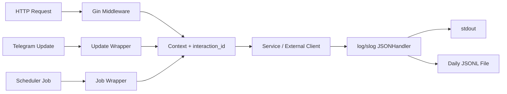

# CopyLingo 아키텍처 문서

## 시스템 개요

JLPT N1 달성을 목표로 하는 개인 일본어 학습 텔레그램 봇.
Go + Gin 백엔드에서 콘텐츠 수집 → AI 문제 생성 → 텔레그램 푸시 → 풀이 → 채점 → 분석 파이프라인을 자동화한다.

## 아키텍처 다이어그램

```
┌─────────────┐     ┌──────────────────┐     ┌─────────────┐
│  Telegram    │────▶│   Go + Gin       │────▶│ PostgreSQL  │
│  Bot API     │◀────│   Server         │◀────│             │
└─────────────┘     ├──────────────────┤     └─────────────┘
                    │ • Bot Handler    │     ┌─────────────┐
                    │ • Lesson Engine  │────▶│ Redis       │
                    │ • SRS Scheduler  │     │ (세션/캐시) │
                    │ • Analytics      │     └─────────────┘
                    └──────┬───────────┘
                           │
                    ┌──────▼───────────┐
                    │ External APIs    │
                    │ • NHK News Easy  │
                    │ • Google TTS     │
                    │ • OpenAI API     │
                    └──────────────────┘
```

## 레이어 구조

```
cmd/server/main.go          ← 엔트리포인트
internal/
├── config/                  ← 설정 관리 (Viper)
├── model/                   ← 도메인 모델 (구조체 정의)
├── repository/              ← 데이터 접근 계층 (PostgreSQL)
├── service/                 ← 비즈니스 로직
│   ├── srs.go               ← SM-2 간격 반복
│   ├── session_builder.go   ← 세션 생성
│   ├── grader.go            ← 채점
│   └── analyzer.go          ← 통계/분석
├── bot/                     ← 텔레그램 봇 핸들러
├── scheduler/               ← 크론 스케줄러
├── pipeline/                ← 콘텐츠 수집/문제 생성 (Phase 2)
└── external/                ← 외부 API 클라이언트 (Phase 2)
```

## 데이터 흐름

### 일일 학습 파이프라인

```
[새벽 3시] 콘텐츠 수집
    ↓
[새벽 3시] AI 문제 생성 + TTS 캐싱
    ↓
[오전 7:30] 오전 세션 빌드 (새60% + 복습40%)
    ↓
[오전 8:00] 텔레그램 푸시
    ↓
[사용자] 문제 풀기 (Inline Keyboard)
    ↓
[시스템] 채점 → SRS 업데이트 → XP 추가 → 스트릭 갱신
    ↓
[오후 8:30] 오후 세션 빌드 (보충20% + 복습80%)
    ↓
[오후 9:00] 텔레그램 푸시 → 풀기 → 채점
```

### 텔레그램 인터랙션 플로우

```
/menu → 메인 메뉴 (Inline Keyboard)
  ├── 📚 학습하기 → 대기 세션 시작 → 문제풀이 루프
  ├── 🔄 복습하기 → SRS 기반 즉시 복습 세션
  ├── 📊 내 통계 → 카테고리별 정답률, 스트릭
  └── ⚙️ 설정 → 세션 시간, 알림 설정

문제풀이 루프:
  [문제 표시 + 4개 선택지 버튼]
    → 답변 선택
  [정답/오답 피드백 + 해설 + 다음 버튼]
    → 다음 문제
  [...반복...]
  [결과 요약 (정답률, XP, 오답 목록)]
```

### 손글씨 Mini App 제출 흐름

손글씨 가나 문항은 Telegram Bot 채팅 UI만으로 입력을 받을 수 없으므로, 해당 문항에서만 Telegram Mini App을 연다.
Bot은 세션 진행을 유지하고, Mini App은 canvas stroke data를 HTTP로 제출한다.

```
[Telegram Bot]
  → web_app button: /miniapp/handwriting?session_id=...&question_id=...&prompt=...
[Mini App]
  → POST /api/miniapp/handwriting/submit
     { init_data, session_id, question_id, strokes }
[Go Server]
  → Telegram init_data 검증
  → session ownership / question membership / duplicate answer 검증
  → stroke data PNG 렌더링
  → LLM Binary Grading
  → session_questions, question stats, SRS 업데이트
```

외부 HTTPS ingress와 Cloudflare Tunnel 운영 메모는 [`HANDWRITING_MINIAPP_INGRESS.md`](HANDWRITING_MINIAPP_INGRESS.md)를 기준으로 한다.

## Callback Data 규약

```
session:{session_id}:start        → 세션 시작
q:{session_id}:{question_id}:{n}  → 답변 선택 (n=0~3)
q:{session_id}:next:{idx}         → 다음 문제
session:{session_id}:finish       → 결과 보기
menu:main                         → 메인 메뉴
menu:study                        → 학습 시작
menu:review                       → 복습 시작
menu:stats                        → 통계
menu:settings                     → 설정
```

## DB 스키마 요약

| 테이블 | PK | 주요 용도 |
|---|---|---|
| `users` | Telegram ID (BIGINT) | 사용자 프로필, 스트릭, XP |
| `contents` | SERIAL | 외부에서 수집한 원문 |
| `materials` | SERIAL | Study Session에서 노출할 학습 단위 SSOT |
| `questions` | SERIAL | Quiz 문항 + 통계 + 현재 전역 SRS 상태 |
| `sessions` | SERIAL | Quiz 학습 세션 상태 |
| `session_questions` | SERIAL | Session별 문항 순서와 답안 |
| `tips` | SERIAL | 손글씨 채점 대기 중 노출할 학습 팁 |

## 핵심 알고리즘: SM-2

```
정답 (quality >= 3):
  repetitions == 0 → interval = 1일
  repetitions == 1 → interval = 6일
  그 외             → interval = interval × ease_factor
  repetitions++

오답 (quality < 3):
  repetitions = 0
  interval = 1일

ease_factor 업데이트:
  EF += 0.1 - (5 - quality) × (0.08 + (5 - quality) × 0.02)
EF = max(EF, 1.3)
```

## Structured Logging

Application Log는 Standard Library `log/slog`의 JSON Handler를 사용한다.
stdout과 `logs/copylingo-YYYY-MM-DD.jsonl`에 동시에 기록하며, 일별 파일은 기본 30일간 보관한다.



Correlation ID 규칙:

| 진입점 | `interaction_id` |
|---|---|
| HTTP | `http-{random 128-bit hex}` |
| Telegram Update | `tg-{update_id}`. 유효한 `update_id`가 없으면 random fallback |
| Scheduler job | `job-{job_name}-{random 128-bit hex}` |

보안 규칙:

- 기록 가능: `user_id`, `chat_id`, `session_id`, `question_id`, status, latency
- 기록 금지: token, Telegram `init_data`, 사용자 답안 원문, stroke 좌표, HTTP body와 query
- 파일 로그는 장애 분석용 Application Log이며 DB 상태나 Audit Log의 SSOT가 아니다.

## 의존성

| 패키지 | 용도 |
|---|---|
| `gin-gonic/gin` | HTTP 서버 |
| `go-telegram-bot-api/v5` | Telegram Bot API |
| `jmoiron/sqlx` | PostgreSQL 접근 |
| `redis/go-redis/v9` | Redis 클라이언트 |
| `robfig/cron/v3` | 크론 스케줄러 |
| `spf13/viper` | 설정 관리 |
| `google/uuid` | UUID 생성 |
| `sashabaranov/go-openai` | OpenAI API (Phase 2) |
