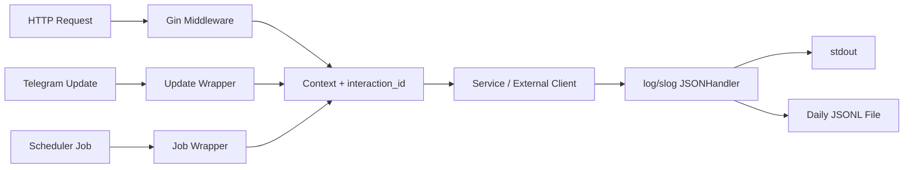

# CopyLingo 아키텍처 문서

## 시스템 개요

JLPT N1 달성을 목표로 하는 개인 일본어 학습 텔레그램 봇.
Go + Gin 백엔드에서 사용자별 세션 생성 → 텔레그램 푸시 → 풀이 → 채점 → SRS 갱신을 처리한다. 콘텐츠는 `cmd/seeding`이 JSON 레코드로 적재한다. 수집 파이프라인은 유지하지만 자동 실행하지 않는다.

## 아키텍처 다이어그램

시스템 구성도, 기술 스택, 실행·배포 방법은 [README의 Architecture](../README.md#architecture)와 [Tech stack](../README.md#tech-stack)을 따른다.

## 레이어 구조

```
cmd/
├── server/                  ← 엔트리포인트
├── seeding/                 ← 언어별 시드 레코드 적재
├── admin/                   ← 운영 도구 (generate_listening_audio, reset_learning_data)
└── dev/                     ← 개발 도구 (goparams, handwriting_renderer)
internal/
├── config/                  ← 설정 관리 (Viper)
├── bootstrap/               ← cmd 바이너리 공통 셋업 (DB 연결, audio 조립)
├── model/                   ← 도메인 모델 (구조체 정의)
├── repository/              ← 데이터 접근 계층 (PostgreSQL)
├── redisstore/              ← Redis 키·직렬화·TTL·원자적 명령
├── service/                 ← 비즈니스 로직
│   ├── srs.go               ← SM-2 간격 반복
│   ├── session_builder.go   ← 세션 생성
│   ├── grader.go            ← 채점
│   └── analyzer.go          ← 통계/분석
├── bot/                     ← 텔레그램 봇 핸들러
├── callback/                ← callback data 형식 공용 정의
├── miniapp/                 ← 손글씨 Mini App HTTP 핸들러
├── scheduler/               ← 크론 스케줄러
├── pipeline/                ← 콘텐츠 수집 (미연결)
├── external/                ← 외부 API 클라이언트 (LLM, TTS, 스토리지)
├── observability/           ← slog·interaction_id·일별 로그 파일
└── testutil/                ← 테스트 공용 헬퍼
```

콘텐츠 수집을 재연결할 때는 `pipeline`의 처리 결과를 `ContentService`가 받아 중복 확인·저장을 수행하고, 서비스만 `ContentRepository`를 사용한다. 현재 자동 수집은 실행되지 않는다.

### 패키지 import 경계

`internal/import_boundary_test.go`가 `go list`로 `internal/...` 각 패키지의 non-test import를 검사한다. 패키지별 허용 목록에 없는 내부 import, 규칙이 없는 새 패키지, 소유 패키지 밖의 드라이버·SDK import(go-redis·`lib/pq`·sqlx·Telegram·go-openai·AWS SDK)는 `make test`에서 실패한다. 경계를 바꾸려면 같은 diff에서 그 표를 고치고 근거를 남긴다. 규칙의 근거는 [ADR-059 §5·§8.4·§8.9](adr/ADR-059_architecture_simplification.md), ADR-061, ADR-069 ([adr/ADR_from_61_to_80.md](adr/ADR_from_61_to_80.md))에 있다.

### Redis 접근 경계

`cmd/server`가 Redis 연결을 만들고 저장 구현을 조립한다. 각 호출자는 사용하는 기능의 인터페이스만 받는다. 연결 생성·종료와 `/health` Ping 외의 Redis 명령, 키 조합, 값 직렬화와 TTL은 `redisstore`가 소유한다.

| 호출자 | 저장 기능 | 호출자에 남는 책임 |
|---|---|---|
| Quiz·Study 서비스 | 세션 working set 읽기·저장·삭제 | 상태 유효성 검사, 진행·완료 전이, DB 복구 |
| Bot | 입력 모드, 답안 대기, 어순 초안, 문항 시작 시각, 메시지 참조, 복구 fingerprint, 손글씨 채점 후 메시지 갱신 | Telegram 입력 해석과 화면 처리 |
| Scheduler | 사용자·슬롯·날짜별 발송 claim | 날짜 결정, Redis 장애 시 경고 후 진행, 발송 정책 |

LLM 입력의 `GetDel` 일회성 소비와 발송 claim의 `SetNX` 원자성은 저장 구현에 둔다. 화면 상태와 발송 claim은 각 호출자가 사용하며 학습 서비스로 우회시키지 않는다. Mini App은 Redis에 의존하지 않는다. 손글씨 메시지 참조는 Bot이 읽는다 (`internal/bot/session_answer.go`, `restart_recovery.go`).

## 데이터 흐름

### 사용자별 세션 발송 파이프라인

```
[매시 :00/:30] 단일 푸시 작업 실행
    ↓
[DB] 사용자 시간대와 네 세션 슬롯에서 현재 시각의 대상 조회
    ↓
[해당 사용자] 세션 생성 또는 미완료 세션 재알림
    ↓
[텔레그램] 사용자에게 세션 푸시
    ↓
[사용자] 문제 풀기 (Inline Keyboard)
    ↓
[시스템] 채점 → Redis working set 기록 → 세션 완료 시 DB flush → SRS·스트릭 갱신
```

### 텔레그램 인터랙션 플로우

```
/menu → 메인 메뉴 (Inline Keyboard)
  ├── 📚 학습하기 → 대기 세션 시작 → 문제풀이 루프
  ├── 🔄 복습하기 → SRS 기반 즉시 복습 세션
  ├── 📊 내 통계 → 카테고리별 정답률, 스트릭
  └── ⚙️ 설정 → 슬롯 시각 4개(각각 끌 수 있음), timezone, 유지·제외 자료
                  (`internal/bot/settings.go`)

Quiz 문제풀이 루프:
  [문제 표시 + 문항 타입별 입력 UI]   ← 타입은 internal/model/question.go 참고
    → 답변 (버튼 선택, 텍스트 입력, 어순 조립, Mini App 등)
  [정답/오답 피드백 + 해설 + 다음 버튼]
    → 다음 문제
  [...반복...]
  [결과 요약 (정답률, 오답 목록)]

Study 카드 흐름:
  [자료 카드] → study:* callback으로 이전/다음/질문/설정 → 완료
```

### 손글씨 Mini App 제출 흐름

손글씨 가나 문항은 Telegram Bot 채팅 UI만으로 입력을 받을 수 없으므로, 해당 문항에서만 Telegram Mini App을 연다.
Bot은 세션 진행을 유지하고, Mini App은 canvas stroke data를 HTTP로 제출한다.

```
[Telegram Bot]
  → web_app button: /miniapp/handwriting?session_id=...&question_id=...&prompt=...
     (language, level, cells도 query로 전달: internal/bot/session_question.go)
[Mini App] → POST /api/miniapp/handwriting/submit
[Go Server] init_data·소유권 검증 → PNG 렌더링 → LLM 채점 → Redis working set 기록
```

`grader.go` → `quiz_active_session.go`의 `RecordAnswer`가 Redis working set에 답을 저장한다. DB(`session_questions`, `user_question_progress`)는 세션 완료 시 `Flush`가 기록한다.
endpoint, 제출 순서, tunnel 설정, 보안은 [`HANDWRITING_MINIAPP_INGRESS.md`](HANDWRITING_MINIAPP_INGRESS.md)를 기준으로 한다.

## Callback Data 규약

```
session:{session_id}:start        → 세션 시작
session:{session_id}:finish       → 결과 보기
q:{session_id}:{question_id}:{n}  → 답변 선택
q:{session_id}:next:{idx}         → 다음 문제
q:{session_id}:ask:{question_id}  → LLM 질문
q:{session_id}:wo:{question_id}:{a|u|r|s}[:{n}] → 어순 선택·되돌리기·초기화·제출
q:{session_id}:policy:{question_id}[:{mode}]   → 연결 자료 설정 (mode 있으면 저장)
menu:{main|study|review|stats|settings}        → 메인 메뉴 이동
study:{session_id}:{start|next|prev|finish|ask|card|policy}[:...] → Study 카드 이동·질문·자료 설정
settings:{view|tz|slot|set_tz|set|materials|restore}[:...]        → 설정, 유지·제외 자료 목록·복원
llm:cancel                        → LLM 입력 취소
```

정확한 형식의 SSOT는 `internal/bot/bot_constants.go`다.

## DB 스키마 요약

| 테이블 | PK | 주요 용도 |
|---|---|---|
| `users` | Telegram ID (BIGINT) | 사용자 프로필, 스트릭, 슬롯 시각·timezone |
| `contents` | SERIAL | 외부에서 수집한 원문 |
| `materials` | SERIAL | Study Session에서 노출할 학습 단위 SSOT |
| `user_material_progress` | (user_id, material_id) | 사용자별 Study 이력 + 현재 SRS 상태 |
| `user_material_preferences` | (user_id, material_id) | 사용자별 유지 복습·제외 설정과 자료 공통 출제 가능 기한 |
| `questions` | SERIAL | language/level별 공유 Quiz 문항 Catalog |
| `user_question_progress` | (user_id, question_id) | 사용자별 Quiz 통계 + 현재 SRS 상태 |
| `sessions` | SERIAL | Quiz·Study 세션 상태 (mode: quiz 또는 study) |
| `session_materials` | SERIAL | Study 세션별 자료 순서와 학습 시각 |
| `session_questions` | SERIAL | Session별 문항 순서와 답안 |
| `tips` | SERIAL | 손글씨 채점 대기 중 노출할 학습 팁 |
| `tip_candidates` | SERIAL | 사용자 LLM 질문·답변 쌍. 이후 팁 후보 |

자료 설정은 학습 이력과 독립적이다. 설정 행이 없으면 일반 학습이며, 유지 복습의
`next_check_at` 이전 또는 제외 상태에서는 새 Study·연결 Quiz 후보에서 제거한다.
기한이 지난 유지 복습은 연결 Quiz로 우선 확인하고, 정답이면 30→60→120→180일,
오답이면 일반 학습으로 복귀한다. Quiz 후보가 없어 Study로 확인하면 같은 간격을 유지한다.
이미 생성된 세션 목록과 Redis 진행 상태에는 소급 적용하지 않는다.
연결 자료가 있는 Quiz 문제의 `⚙️ 연결 자료 설정` 버튼은 유지 복습·학습 제외
두 선택지를 열며, 선택한 설정은 새 세션부터 적용한다. 현재 Quiz 문제는 그대로 진행한다.
세부 규칙: [ADR-051](adr/ADR-051_user_material_preferences.md).

## 핵심 알고리즘: SM-2

```
정답 (quality >= 3):
  repetitions == 0 → interval = 3일
  repetitions == 1 → interval = 6일
  그 외             → interval = interval × ease_factor
  repetitions++

오답 (quality < 3):
  repetitions = 0
  interval = 1일

ease_factor 업데이트:
  EF += 0.1 - (5 - quality) × (0.08 + (5 - quality) × 0.02)
EF = max(EF, 1.3)
```

## Structured Logging

Application Log는 Standard Library `log/slog`의 JSON Handler를 사용한다.
stdout과 `logs/copylingo-YYYY-MM-DD.jsonl`에 동시에 기록하며, 일별 파일은 기본 30일간 보관한다.


```mermaid
flowchart LR
    HTTP[HTTP Request] --> HM[Gin Middleware]
    TG[Telegram Update] --> TM[Update Wrapper]
    JOB[Scheduler Job] --> JM[Job Wrapper]
    HM --> CTX[Context + interaction_id]
    TM --> CTX
    JM --> CTX
    CTX --> APP[Service / External Client]
    APP --> SLOG[log/slog JSONHandler]
    SLOG --> STDOUT[stdout]
    SLOG --> FILE[Daily JSONL File]
```

Correlation ID 규칙:

| 진입점 | `interaction_id` |
|---|---|
| HTTP | `http-{random 128-bit hex}` |
| Telegram Update | `tg-{update_id}`. 유효한 `update_id`가 없으면 random fallback |
| Scheduler job | `job-{job_name}-{random 128-bit hex}` |

보안 규칙:

- 기록 가능: `user_id`, `chat_id`, `session_id`, `question_id`, status, latency
- 기록 금지: token, Telegram `init_data`, 사용자 답안 원문, stroke 좌표, HTTP body와 query
- 파일 로그는 장애 분석용 Application Log이며 DB 상태나 Audit Log의 SSOT가 아니다.
