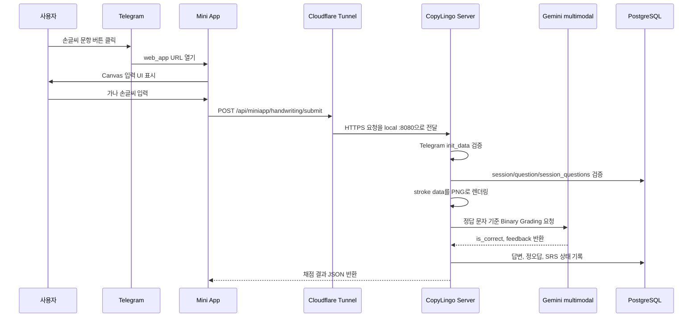

# 손글씨 Mini App 제출 및 Cloudflare Tunnel 운영 메모

## 목적

손글씨 가나 문항은 Telegram Mini App에서 입력을 받고, CopyLingo 서버가 HTTP로 제출을 받아 채점한다.
이 문서는 다음 세 가지를 기록한다.

1. 사용자가 제출한 손글씨 데이터를 서버가 어떤 방식으로 받아 처리하는지
2. `cloudflared`가 무엇이며 CopyLingo 개발 환경에서 어떻게 사용하는지
3. `cloudflared` 사용 시 보안상 주의할 점과 현재 코드에서 실제로 조치된 점

## 제출 및 채점 흐름



현재 HTTP endpoint는 다음 두 개다.

- `GET /miniapp/handwriting`
- `POST /api/miniapp/handwriting/submit`

Mini App은 제출 시 아래 JSON을 서버로 보낸다.

```json
{
  "init_data": "<telegram-web-app-init-data>",
  "session_id": 123,
  "question_id": 456,
  "strokes": [
    {
      "points": [
        {"x": 10.4, "y": 22.1, "time_ms": 1700000000000, "drawing": true}
      ]
    }
  ]
}
```

서버 처리 순서는 보수적으로 구성한다.

1. `init_data` 검증: Telegram이 발급한 Web App init data인지 HMAC 기반으로 확인한다.
2. 사용자 소유권 확인: `session.user_id`와 `init_data`에서 나온 Telegram user id가 일치해야 한다.
3. 문항 검증: `question_id`가 해당 세션에 포함되어 있어야 한다.
4. 타입 검증: 문항 타입은 `kana_handwriting`이어야 한다.
5. 중복 제출 방지: 이미 답변된 문항이면 `409 Conflict`를 반환한다.
6. stroke 렌더링: 클라이언트가 보낸 좌표를 서버에서 PNG로 렌더링한다.
7. Binary Grading: LLM에게 open-ended OCR을 시키지 않고, "이 손글씨가 정답 문자 X로 볼 수 있는가"만 판단하게 한다.
8. 결과 기록: 정오답, 통계, SRS schedule을 업데이트한다.

이 구조를 쓰는 이유는 명확하다.

- Telegram Bot 채팅 UI는 canvas 입력을 제공하지 않는다.
- 휴대폰 Telegram 앱은 개발 머신의 `localhost`에 접근할 수 없다.
- 클라이언트가 채점 결과를 직접 만들면 조작 가능하므로 채점과 DB 기록은 서버 책임이어야 한다.
- stroke-first 전송은 raw image upload보다 payload가 작고, 서버에서 이미지 크기와 포맷을 통제할 수 있다.
- 정답을 이미 알고 있는 문항이므로 OCR보다 Binary Grading이 더 단순하고 안정적이다.

## cloudflared 역할

`cloudflared`는 로컬에서 실행 중인 HTTP 서버를 Cloudflare edge를 통해 공개 HTTPS URL로 노출하는 터널 클라이언트다.
CopyLingo 개발 환경에서는 로컬 Go 서버 `http://localhost:8080`을 `https://xxxxx.trycloudflare.com` 같은 URL로 임시 공개하는 용도로 사용한다.

개발 환경 실행 순서:

```bash
export COPYLINGO_TELEGRAM_TOKEN="<telegram-bot-token>"
export COPYLINGO_LLM_API_KEY="<gemini-api-key>"

make infra
make migrate
go run ./cmd/ja/kana_seeder
go run ./cmd/server
```

다른 터미널에서 tunnel을 연다.

```bash
make tunnel
```

`make tunnel`은 내부에서 `cloudflared tunnel --url http://localhost:8080`을 실행하고, 출력된 `https://xxxxx.trycloudflare.com` URL을 `.env`의 `COPYLINGO_SERVER_PUBLIC_BASE_URL`에 자동으로 반영한다.
서버는 시작 시점에 `.env`를 읽으므로, tunnel URL이 갱신되면 CopyLingo 서버를 재시작해야 한다.

수동으로 설정할 경우에는 출력된 HTTPS URL을 서버 설정에 직접 주입한다.

```bash
export COPYLINGO_SERVER_PUBLIC_BASE_URL="https://xxxxx.trycloudflare.com"
go run ./cmd/server
```

BotFather에서도 같은 host를 Mini App/Web App domain으로 등록한다.
임시 tunnel URL은 재실행 시 바뀔 수 있으므로, URL이 바뀌면 아래 두 곳을 같이 갱신해야 한다.

- `COPYLINGO_SERVER_PUBLIC_BASE_URL`
- BotFather에 등록된 Mini App/Web App domain

## 보안 주의사항

Cloudflare Tunnel은 OS/router에서 inbound port를 직접 열지 않아도 되는 장점이 있지만, tunnel이 켜진 동안에는 연결한 local service가 인터넷에서 접근 가능해진다.
따라서 "로컬이라 안전하다"는 가정은 tunnel 실행 순간부터 깨진다.

주의해야 할 점:

- tunnel 대상은 필요한 HTTP 서버 하나로 제한한다. CopyLingo 기준 대상은 `http://localhost:8080`이다.
- PostgreSQL `5432`, Redis `6379`을 tunnel 대상으로 잡지 않는다.
- Telegram token, LLM API key, DB password를 URL query, client JS, 로그에 노출하지 않는다.
- Mini App 요청은 반드시 Telegram `init_data`를 검증한 뒤 처리한다.
- 클라이언트가 보낸 `user_id`, `session_id`, `question_id`, `is_correct`를 신뢰하지 않는다.
- `trycloudflare.com` 임시 URL은 공유 범위를 제한하고, 테스트가 끝나면 tunnel 프로세스를 종료한다.
- 운영 배포에서는 임시 URL 대신 고정 도메인, HTTPS reverse proxy 또는 Cloudflare named tunnel을 사용한다.
- public 서버에서는 app 외부 노출면과 DB/Redis 노출면을 분리한다.

## 현재 실제 조치된 점

현재 코드에서 확인된 조치:

- `POST /api/miniapp/handwriting/submit`은 `init_data`, `session_id`, `question_id`, `strokes`를 필수 JSON으로 받는다.
- `internal/miniapp`는 Telegram `init_data`를 검증하고, 검증 실패 시 `401 Unauthorized`를 반환한다.
- `init_data` 검증기는 24시간 max age로 생성된다.
- `internal/service/handwriting.go`는 세션 소유자와 Telegram user id 불일치 시 `ErrHandwritingUnauthorized`를 반환한다.
- 제출된 문항이 세션에 없으면 `ErrHandwritingQuestionMismatch`를 반환한다.
- 문항 타입이 `kana_handwriting`이 아니면 `ErrHandwritingInvalidQuestion`을 반환한다.
- 이미 답변된 문항은 `ErrHandwritingAlreadyAnswered`로 막고 HTTP `409 Conflict`로 응답한다.
- Mini App client는 같은 origin의 `/api/miniapp/handwriting/submit`으로 제출하므로, Telegram token이나 LLM API key를 browser에 전달하지 않는다.
- 서버는 raw stroke data를 받은 뒤 자체 PNG renderer로 렌더링하여 LLM에 전달한다.
- `server.public_base_url`은 환경변수 `COPYLINGO_SERVER_PUBLIC_BASE_URL`로 주입할 수 있어, tunnel URL을 코드에 하드코딩하지 않아도 된다.

현재 미조치 또는 운영 전 보완 필요:

- `docker-compose.yml`은 현재 PostgreSQL `5432`, Redis `6379`, app `8080`을 host port로 publish한다. 로컬 개발에는 편하지만 public 서버에서는 DB/Redis를 외부 interface에 노출하지 않도록 바인딩을 제한하거나 ports를 제거해야 한다.
- HTTP server에는 별도 rate limit middleware가 없다. tunnel URL이 외부에 노출되는 운영성 테스트에서는 submit endpoint rate limit을 추가하는 것이 안전하다.
- 임시 `trycloudflare.com` URL은 재시작 시 바뀔 수 있다. 반복 테스트 또는 운영에는 named tunnel 또는 고정 도메인이 필요하다.

## 권장 운영 기준

개발:

- `make tunnel`
- `.env`의 `COPYLINGO_SERVER_PUBLIC_BASE_URL=https://xxxxx.trycloudflare.com` 자동 갱신 확인
- CopyLingo 서버 재시작
- 테스트 종료 후 tunnel 프로세스 종료

운영:

- `https://copylingo.example.com` 같은 고정 도메인 사용
- public ingress는 `443/tcp`만 허용
- reverse proxy 또는 named tunnel 뒤에 Go app 배치
- DB/Redis는 private network 또는 localhost bind만 허용
- BotFather domain과 `COPYLINGO_SERVER_PUBLIC_BASE_URL` host를 항상 일치시킴
