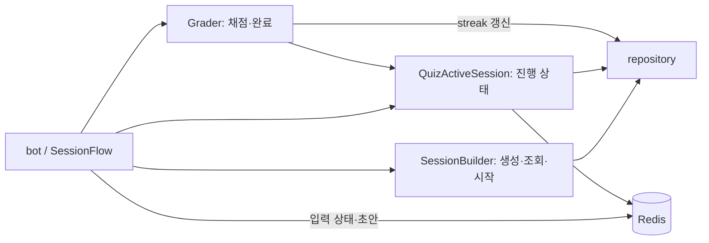
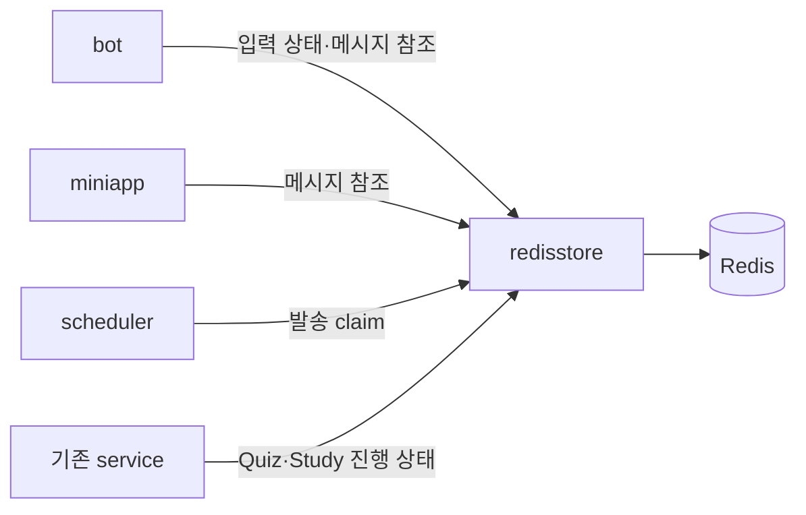
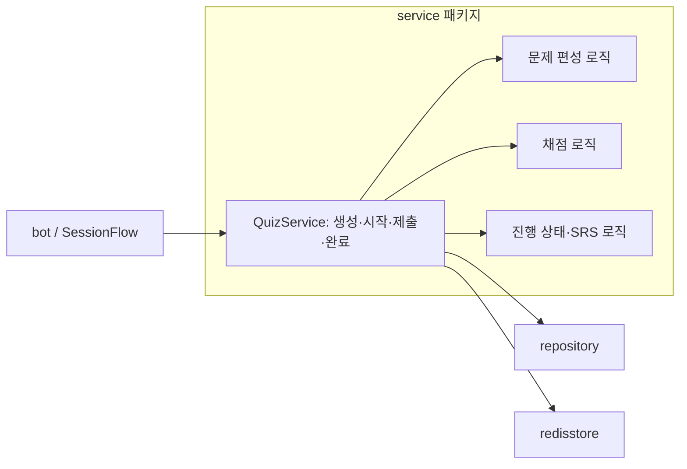
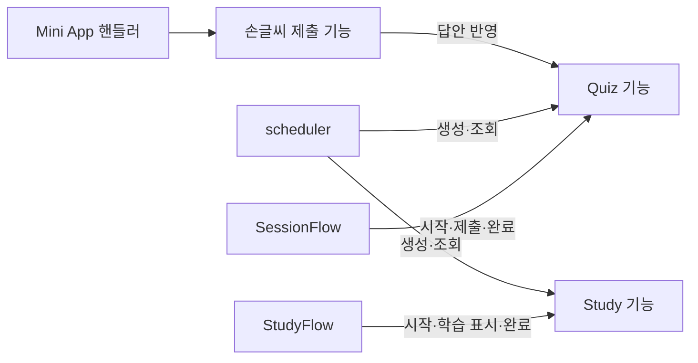

# ADR-059: 기능별 호출 경계와 서버 초기화 구조 단순화

- 날짜: 2026-09-26
- 상태: **설계 방향 승인, 1단계 완료; 2·3단계 미착수**
- 범위: 패키지 간 호출 경계, Quiz·Study 책임 배치, Redis 접근, 서버 인스턴스 생성·주입
- 관련 결정: [ADR-057·058·060](ADR_from_41_to_60.md), [1단계 구현 기록](../workthrough/2609/2609262045_redis_access_boundary.md)

## 1. 배경과 목표

현재 코드는 한 기능을 이해하려면 봇, 여러 서비스, Redis 상태를 함께 추적해야 한다. 서버 시작 코드에서도 같은 설정·서비스·연결 객체를 여러 초기화 함수에 반복 전달한다.

사용자는 프로젝트 전반의 의존 관계와 패키지 크기·파편화를 조사하고, 호출 경로와 초기화 구조를 단순화하는 방향에 동의했다. 이 문서는 그 논의를 단계별 구조 변화로 기록한 것이다. 독립 실행용 TODO나 구현 완료 보고서는 아니다.

목표는 다음과 같다.

1. Quiz 동작은 Quiz 담당 서비스에서, 화면 동작은 해당 핸들러에서 출발해 읽을 수 있다.
2. 각 객체의 생성자에서 실제 필요한 의존성을 확인할 수 있다.
3. Redis 저장 형식과 외부 클라이언트 생성은 해당 구현·조립 위치에 모인다.
4. 서버 조립 함수 한곳에서 전체 연결을 확인하고, 실행 단계에서는 완성된 객체를 시작·종료한다.

수만 사용자 규모를 가정한다. 현재의 working set, 트랜잭션, 멱등성, batch 조회, worker와 rate limit은 구조 정리 과정에서도 유지한다.

## 2. 리팩터링 전 구조에서 확인한 문제

설계 조사 당시(1단계 구현 전)의 working tree 기준 `internal`은 11개 패키지, 구현 Go 파일 78개, 12,719줄이었다. 테스트를 제외하고 주석·빈 줄을 포함한 수치다. `go list ./...`가 통과했고, 패키지 순환 의존이나 `bot → repository` 직접 import는 없었다. 아래 문제 목록은 그 시점의 조사 기록이다.

| 패키지 | 구현 줄 수 | 판단 |
|---|---:|---|
| `bot` | 3,708 | 화면 처리에 세션 정책·Redis 조작이 섞여 있어 우선 정리 |
| `service` | 2,762 | 기능별 책임과 공개 API의 분산을 정리 |
| `repository` | 2,398 | 쿼리와 트랜잭션 경계 유지 |
| `external` | 986 | 패키지 유지, 소비자가 사용하는 계약의 범위 점검 |
| `model` | 712 | 공통 모델·상태 소유 |
| `scheduler` | 612 | 실행 제어 유지, 서비스와 저장 기능의 주입 범위 축소 |
| `miniapp` | 405 | HTTP 처리와 Telegram 메시지 갱신 책임 구분 |
| `config` | 391 | 실행 설정 이외의 상수를 소유 위치로 이동 |
| `observability` | 358 | 유지 |
| `pipeline` | 308 | 자동 실행 비활성 상태와 기존 보존 결정 유지 |
| `callback` | 79 | 공유 callback 규약 유지, Redis 값 파싱 책임 이동 |

줄 수 자체를 패키지 분리 기준으로 사용하지 않는다. 다음 코드가 책임 분산의 직접적인 근거다.

- [Services](../../internal/service/services.go)는 서비스 16개를 공개하고, Bot은 그중 12개에 접근한다.
- [SessionFlow](../../internal/bot/session_flow.go)와 [StudyFlow](../../internal/bot/study_flow.go)는 `*Bot` 전체를 받아 API·설정·서비스·Redis에 접근한다.
- [SessionBuilder](../../internal/service/session_builder.go)는 생성 외에 조회·시작도 담당한다. 완료는 [Grader](../../internal/service/grader.go)에 있다.
- [봇 답안 처리](../../internal/bot/session_answer.go)는 AI 채점 설정이 없으면 직접 `QuizActiveSession.RecordAnswer(false)`를 호출한다.
- [Mini App](../../internal/miniapp/handler.go)은 봇이 기록한 Redis 키·값 형식을 알고 Telegram 버튼까지 구성한다.
- 세션 상태가 [config](../../internal/config/constants.go)와 [model](../../internal/model/session.go)에 중복 정의돼 있다.
- [서버 시작 코드](../../cmd/server/main.go)는 서비스·봇·DB·Redis를 worker와 router 초기화에 반복 전달한다.

## 3. 현재에서 최종 구조까지

아래 화살표는 주요 호출 관계다. 모든 import나 보조 기능을 표시한 그래프는 아니다. 변경 후의 타입·메서드명은 설계를 설명하는 예시이며 실제 API는 소스 코드를 따른다. 1단계는 구현됐고, Quiz 책임 통합과 서버 초기화 정리는 후속 단계다.

### 현재: 봇이 Quiz의 여러 세부 기능을 직접 조정



답안 제출을 이해하려면 화면 처리뿐 아니라 상태 조회·채점·실패 시 기록 순서를 함께 읽어야 한다. 시작과 완료도 서로 다른 이름의 서비스에 배치돼 있다.

### 1단계: Redis 저장 구현을 모으기

신규 패키지 `internal/redisstore`가 키·직렬화·TTL·Redis 오류 변환·원자적 명령을 소유한다. 기존 Redis TODO를 실행했으며 구체적인 저장 계약과 검증 결과는 [1단계 구현 기록](../workthrough/2609/2609262045_redis_access_boundary.md)에 남겼다.



호출자는 `Get/Set`이나 문자열 키 대신 `GetHandwritingMessage`, `ConsumePending`, `TryClaim` 같은 기능을 사용한다. 각 호출자에는 필요한 기능 인터페이스만 전달한다.

Telegram 입력·화면 상태와 scheduler claim은 각 호출자의 저장 인터페이스로 다룬다. 모든 Redis 접근을 학습 서비스에 넣지 않는다. 서버 조립부의 연결 생성·종료와 health Ping은 유지한다.

**단계 완료 후:** 저장 포맷 변경을 `redisstore`에서 추적할 수 있다. Quiz 책임 분산은 아직 남아 있다.

### 2단계: Quiz·Study의 처리 책임 모으기

Quiz의 생성·시작·답안 제출·완료를 담당하는 공개 진입점을 정한다. 기존 `SessionBuilder`·`Grader`·`QuizActiveSession`과 봇의 책임을 재배치한다. 기존 메서드를 그대로 노출하는 전달 계층을 추가하는 방식은 피한다.



이 그림의 `QuizService`는 처리 순서와 정책을 책임지는 주체다. 모든 계산을 한 파일로 합치거나 생성·채점·상태 처리를 새 패키지로 각각 분리하라는 뜻은 아니다. 하위 계산과 저장 호출은 내부 구현으로 유지할 수 있다.

| 사용자 동작 | 현재 봇이 조정하는 내용 | 변경 후 진입점 예시 |
|---|---|---|
| 시작 | 진행 상태 조회, 소유자 확인, 시작 반영 | `Quiz.Start(...)` |
| 제출 | 현재 문제 확인, 채점 요청, 실패 시 기록 | `Quiz.SubmitAnswer(...)` |
| 완료 | 완료 서비스 호출, 후속 화면 상태 정리 | `Quiz.Complete(...)` |

```text
bot
  Telegram 입력 해석 → Quiz.SubmitAnswer → 결과 표시

Quiz.SubmitAnswer
  소유자·문제·중복 제출 검증
  → 문제 유형에 따른 채점
  → 기존 정책에 따른 답안·진행 상태 반영
  → 처리 결과 반환
```

Study는 현재 `StudyActiveSession.Start/MarkStudied/Complete`에 모인 흐름을 활용한다. 손글씨의 입력 검증·이미지 처리 경계는 유지하면서 공통 답안 반영은 Quiz 담당 로직으로 연결한다. 유형별 채점 실패 정책을 임의로 통일하지 않는다.

**단계 완료 후:** Quiz 동작 변경은 Quiz 담당 서비스에서 출발한다. 봇은 내부 서비스의 호출 순서나 답안 기록 정책을 알 필요가 없어진다.

### 3단계: 필요한 기능만 주입하고 소유권 고정하기

`SessionFlow`, `StudyFlow`, scheduler에 전체 `Services`나 `*Bot`을 전달하지 않는다. 각 객체가 사용하는 기능과 설정만 받게 한다. 같은 Quiz 구현도 scheduler에는 생성·조회 계약만, 풀이 흐름에는 시작·제출·완료 계약을 제공할 수 있다.



Mini App의 Telegram 버튼 구성은 봇의 좁은 메시지 갱신 계약으로 옮긴다. Mini App은 손글씨 처리 후 화면 갱신을 요청하고, 봇이 Telegram 표현을 소유한다. 이 연결을 위해 이벤트 버스를 도입하지 않는다.

| 대상 | 소유 위치 |
|---|---|
| 환경변수·실행 설정 | `config` |
| 세션 상태 | `model` |
| Telegram callback 규약 | `callback` 또는 봇 내부 |
| Redis 키·값 포맷 | `redisstore` |

**단계 완료 후:** 생성자에서 해당 객체의 호출 범위가 보인다. 기능 인터페이스로 메서드 접근을 좁히고 금지 import 검사로 패키지 경계를 고정한다.

## 4. 서버 시작·인스턴스 초기화도 함께 정리

좁은 인터페이스를 도입하는 것만으로 생성자 인자 수가 줄지는 않는다. 객체 생성 위치와 전달 경로도 함께 바꾼다. 이 작업은 3단계에 포함하며, 1·2단계의 생성자 변경도 같은 조립 위치에서 반영한다.

현재는 다음 경로에 초기화와 전달이 분산돼 있다.

```text
run → initApp → NewRepositories / NewServices / NewBot
run → startWorkers → initScheduler → scheduler.New
run → setupRouter → miniapp.RegisterRoutes → miniapp.NewHandler
```

목표는 `cmd/server`의 조립 함수에서 다음 순서로 한 번 연결하는 것이다. 단계별 코드는 기존 파일에 나눠 둘 수 있지만, 인자 전달만을 위한 중간 함수를 늘리지 않는다.

```text
DB·Redis 연결
  → 저장소·외부 API 클라이언트 생성
  → Quiz·Study 등 서비스 생성
  → Bot·Mini App·Scheduler 생성
  → HTTP 서버 연결
  → 실행·종료할 객체 반환
```

현재 `service.NewServices` 안의 LLM·TTS·S3 클라이언트 생성도 조립 위치로 이동한다. DB·Redis 연결과 공유 클라이언트는 필요한 범위에서 한 번 생성해 재사용한다. 사용처마다 새 연결을 만들지 않는다.

라우터는 완성된 핸들러의 경로를 등록한다. 다음은 책임 변화를 보여주는 예시다.

```go
// 현재: 핸들러 생성에 필요한 재료까지 전달한다.
setupRouter(cfg, db, rdb, services, botHandler)

// 목표: 준비된 핸들러의 경로만 연결한다.
setupRouter(healthHandler, miniappHandler)
```

설정·로깅 이후의 시작 코드는 다음과 같은 형태를 목표로 한다. `initApp`, `Run`, `Close`의 최종 시그니처는 구현 시 정한다.

```go
// 조립 결과의 시작·종료만 최상위에서 관리한다.
app, err := initApp(cfg)
if err != nil {
    return err
}
defer app.Close()
return app.Run()
```

`app`은 `cmd/server` 내부의 작은 실행 객체로, Bot·Scheduler·HTTP 서버와 자원 정리를 소유한다. 하위 서비스에 전달하는 전역 의존성 컨테이너로 사용하지 않는다. 초기화 중간 실패 시 이미 연 자원을 정리하고, 정상 종료 시 작업 중단과 연결 종료 순서를 명확히 한다.

이 변경 후에도 실제 객체 생성 코드는 남는다. 반복 전달과 분산된 초기화를 줄이는 것이 목적이며, 필요한 연결을 감추기 위한 DI 프레임워크·전역 변수·범용 컨테이너는 도입하지 않는다.

## 5. 최종 패키지 배치와 허용 경계

```text
cmd/server/        객체 생성·연결·시작·종료
internal/
  bot/             Telegram 입력과 화면
  miniapp/         HTTP 입력과 응답
  scheduler/       실행 시점과 발송 제어
  service/         Quiz·Study 등 기능별 처리 책임
  repository/      PostgreSQL 조회와 트랜잭션
  redisstore/      Redis 저장 구현 — 신규
  external/        LLM·TTS·S3 등 외부 연동
  model/           공통 모델과 상태
  config/          실행 설정
  callback/        Telegram callback 규약
  observability/   로그
  pipeline/        콘텐츠 수집
```

Quiz와 Study 담당 서비스는 기존 `service` 패키지의 구성요소다. 이 계획에서 내부 패키지는 11개에서 12개가 된다. 추가적인 기능별 패키지 분리는 이번 방향에 포함하지 않는다.

| 호출자 | 허용할 의존·역할 |
|---|---|
| `cmd/server` | 구현체 생성과 연결, 연결 상태 확인, 생명주기 관리 |
| `bot`, `miniapp`, `scheduler` | 필요한 서비스 기능과 각자의 기술적 상태 저장 인터페이스 |
| `service` | 모델, 필요한 저장·외부 연동 계약 |
| 저장·외부 연동 구현 | DB·Redis·외부 API 호출 |
| `model` | 다른 애플리케이션 레이어에 의존하지 않음 |

호출 관계와 import 관계는 구분한다. 인터페이스 주입은 객체가 사용할 수 있는 메서드를 제한한다. 소스 파일의 금지 import는 별도 검사로 확인한다. 인터페이스만 만들고 raw Redis 타입이나 전체 서비스 묶음을 그대로 노출하는 변경은 완료로 보지 않는다.

## 6. 결과와 trade-off

- Redis 패키지와 필요한 기능 인터페이스가 생기므로 파일·선언 수 일부는 늘 수 있다. 대신 저장 계약의 중복 지식과 넓은 서비스 접근을 줄인다.
- Quiz 공개 진입점을 정리하면서 기존 호출자와 테스트 수정이 필요하다. 세부 정책은 유지하고 책임 이동과 기능 변경을 섞지 않는다.
- 조립 코드는 서비스 패키지에서 `cmd/server`로 이동한다. 최상위 `run`은 간결해지지만 실제 연결은 조립부에 명시적으로 남는다.
- SQL의 eligibility 필터·정렬과 완료 트랜잭션을 기계적으로 service로 옮기지 않는다. DB에서 수행할 필터링과 원자적 저장은 보존한다.
- 작은 공유 패키지의 통폐합이나 전체 feature별 디렉터리 재배치는 하지 않는다. 변경하지 않는 선택도 유지한다.
- ADR-057·058의 자동 콘텐츠 수집 비활성 및 관련 코드 보존 결정을 변경하지 않는다. 새로운 실행 경로를 켜지 않는다.

## 7. 실행 순서와 완료 확인

| 순서 | 작업 | 단계 완료 시 확인할 결과 |
|---|---|---|
| 1 (완료) | Redis 저장 경계 정리 | 호출자가 키·직렬화·Redis 명령 반환 타입을 모름 |
| 2 | Quiz 책임 통합, Study 경계 정리 | 화면 코드가 채점·답안 기록·완료 정책을 직접 조정하지 않음 |
| 3 | 좁은 기능 주입, 서버 조립 통합, 상수 이동 | 한 조립 경로에서 생성 순서를 확인하고 각 생성자에서 의존 범위를 읽을 수 있음 |

구현 범위는 단계별로 잡는다. 후속 단계의 정확한 메서드명, 내부 helper 유지·통합 위치, 실행 객체의 종료 API는 설명용 예시만으로 확정하지 않는다. 기존 Redis TODO는 1단계 완료 후 제거하고 위 구현 기록에 결과를 남겼다.

후속 구현에서는 기존 테스트로 세션 시작·재개·중복 제출·채점 실패·완료, 손글씨 화면 갱신, 발송 claim을 확인한다. 키·TTL·원자성·트랜잭션·worker·rate limit의 동작을 보존한다. 서버 조립 변경은 초기화 실패 시 정리와 정상 시작·종료도 확인한다.

코드 변경 시 프로젝트 규칙에 따라 `make test`를 수행한다. 로컬 런타임 변경은 Makefile의 타깃 설명에 따라 앱을 재시작하고 `/health`를 확인한다. 이번 문서 export는 코드·설정·실행 상태를 변경하지 않으므로 해당 실행 검증 대상이 아니다.
