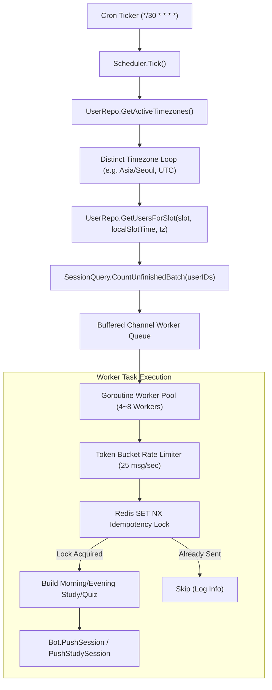

# 동적 사용자 스케줄링 및 30분 슬롯 분산 푸시 시스템 구현 계획

## 1. 개요 및 배경
- **목적**: 기존 하드코딩된 정적 Cron(08:00, 12:00, 16:30, 21:00) 기반 전원 일괄 푸시 방식을 탈피하여, 유저가 원하는 시각(30분 단위)에 맞춰 개인화된 학습/퀴즈 세션을 전송하는 시스템 구축.
- **가정 스케일**: 10,000명 이상의 유저가 다양한 시각과 Timezone에 분산된 환경(Portfolio 기준).
- **관련 표준**: ADR-045(세션 백로그 3개 상한), ADR-047(Study 믹스 정책), AGENTS.md Case A/B/C.

---

## 2. 4단계 표준 검토 합의 사항 요약

| 영역 | 결정 사항 | 핵심 근거 |
|------|-----------|-----------|
| **1. 아키텍처** | 30분 간격 Tick + Timezone 파티셔닝 쿼리 + Goroutine Worker Pool | Kafka/SFN 등 외부 인스턴스 없이 Go 내장 채널과 고루틴으로 25 msg/sec 제어 |
| **2. 코드 품질** | 단일 `sessionDispatcher`로 DRY 통합 + `TIME NULL` 기반 ON/OFF | 세션 빌드/푸시 복제 제거, Tip/Audio Top-up 분리는 Case C TODO로 분리 |
| **3. 테스트** | Timezone Table-Driven 테스트 + `miniredis` 멱등성 + `go test -race` | 동시성 Deadlock/Race 방지 및 중복 푸시 차단 검증 |
| **4. 성능** | Distinct Timezone 인덱스 스캔 + `CountUnfinished` 배치 쿼리 (N+1 제거) | 30분 슬롯당 DB 쿼리 수 1/N 축소 및 DB 커넥션 풀 경합 방지 |

---

## 3. 세부 아키텍처 및 데이터 흐름

---

## 4. 단계별 구현 계획 (Atomic Steps)

### Step 1: DB 스키마 마이그레이션 및 Model 개편
1. **Migration 파일 추가**: `migrations/002_user_session_schedules.sql`
   - 기존 `morning_session_time`, `evening_session_time`을 세분화:
     - `morning_study_time TIME NULL DEFAULT '08:00'`
     - `morning_quiz_time TIME NULL DEFAULT '12:00'`
     - `evening_study_time TIME NULL DEFAULT '16:30'`
     - `evening_quiz_time TIME NULL DEFAULT '21:00'`
     - `timezone VARCHAR(50) NOT NULL DEFAULT 'Asia/Seoul'`
   - 부분 인덱스(Partial Index) 추가:
     - `idx_users_tz_morning_study ON users(timezone, morning_study_time) WHERE morning_study_time IS NOT NULL;`
     - `idx_users_tz_morning_quiz ON users(timezone, morning_quiz_time) WHERE morning_quiz_time IS NOT NULL;`
     - `idx_users_tz_evening_study ON users(timezone, evening_study_time) WHERE evening_study_time IS NOT NULL;`
     - `idx_users_tz_evening_quiz ON users(timezone, evening_quiz_time) WHERE evening_quiz_time IS NOT NULL;`
2. **Model 수정**: `internal/model/user.go`
   - `User` 구조체에 4개 슬롯 필드 반영 (포인터 `*string`을 사용하여 NULL=비활성화 지원).

### Step 2: Repository 및 Service 계층 확장
1. **User Repository 확장**: `internal/repository/user_repo.go`
   - `GetActiveTimezones(ctx context.Context) ([]string, error)`: 활성 유저의 고유 타임존 목록 조회.
   - `GetUsersBySlot(ctx context.Context, slot string, localTime string, timezone string) ([]model.User, error)`: 복합 인덱스 활용 슬롯 대상 조회.
   - `UpdateSlotTime(ctx context.Context, userID int64, slot string, timeVal *string) error`: 슬롯별 시간 변경/해제.
   - `UpdateTimezone(ctx context.Context, userID int64, timezone string) error`: 유저 타임존 변경.
2. **N+1 방지 Batch Query 추가**: `internal/repository/session_query_repo.go`
   - `CountUnfinishedBatch(ctx context.Context, userIDs []int64) (map[int64]int, error)`: `WHERE user_id IN (?) AND status IN ('pending', 'in_progress') GROUP BY user_id`.
3. **User Service 검증 로직**: `internal/service/user.go`
   - `ScheduleTime` 30분 단위 화이트리스트 검증 (`HH:00` 또는 `HH:30`).
   - IANA Timezone 유효성 검증 (`time.LoadLocation`).

### Step 3: 스케줄러 디스패처 & 워커 풀 구현 (DRY 리팩토링)
1. **단일 세션 디스패처**: `internal/scheduler/dispatcher.go`
   - `sessionDispatcher`: 세션 빌드(Study vs Quiz), 미완료 카운트 검사, 백로그 리마인드(`remindUnfinishedSession`), 텔레그램 푸시를 단일 제어 루프로 통합.
2. **인메모리 Worker Pool & Rate Limiter**:
   - `golang.org/x/time/rate` 기반 25 msg/sec Limiter.
   - 고루틴 워커 풀(Worker 4~8개) 및 `sync.WaitGroup` 기반 Graceful Shutdown.
3. **Redis 멱등성 락**:
   - Key: `copylingo:push:lock:{user_id}:{slot}:{date}` (TTL 24시간).
   - `SET NX` 성공 시에만 세션 빌드 및 푸시 진행.
4. **스케줄러 틱 재배치**: `internal/scheduler/scheduler.go`
   - `*/30 * * * *` Cron 등록.
   - 매 30분마다 4개 슬롯에 대해 각 타임존별 로컬 시각을 계산하여 디스패치.

### Step 4: 텔레그램 봇 설정 UI 연동
1. **설정 핸들러 구현**: `internal/bot/settings.go`
   - `ActionMenuSettings` ("⚙️ 설정") 클릭 시 현재 4개 슬롯 설정 상태 및 변경 메뉴 전송.
   - 슬롯 선택 시 30분 단위 시간 선택 인라인 키보드 제공 (`07:00`, `07:30`, `08:00`, ... 및 `🔕 비활성화(OFF)`).
2. **Callback 라우팅**: `internal/bot/handler.go`
   - `settings:view`
   - `settings:slot:<slot_name>`
   - `settings:set:<slot_name>:<time_or_off>`
   - `settings:tz:<timezone>`

### Step 5: 테스트 작성 및 검증
1. **Timezone 및 슬롯 매칭 단위 테스트**: `internal/repository/user_repo_test.go`
2. **Worker Pool 동시성 및 Rate Limit 테스트**: `internal/scheduler/dispatcher_test.go` (`go test -race`)
3. **Redis 멱등성 락 및 스킵 테스트**: `miniredis` 기반 테스트.
4. **Bot 설정 콜백 테스트**: `internal/bot/settings_test.go`.

### Step 6: Case C 분리 및 ADR 등록
1. **Case C TODO 문서 생성**: `docs/todos/decouple_tip_audio_topup_cron.md` (Tip/Audio Top-up 시스템 Cron 분리 계획).
2. **STATUS.md 업데이트**: TODO 등록.
3. **ADR-048 문서 작성**: `docs/adr/ADR_from_41_to_60.md`에 기술 결정 및 트레이드오프 기록.

---

## 5. 리스크 및 롤백 전략
- **DB 호환성**: 신규 컬럼에 기본값(`08:00`, `12:00`, `16:30`, `21:00`)을 부여하여 기존 유저의 푸시 시각은 기존과 100% 동일하게 유지됨.
- **장애 시 롤백**: 스케줄러 틱 실패 시 즉시 이전의 정적 Cron 등록 방식으로 롤백 가능한 단일 토글 구조 유지.
