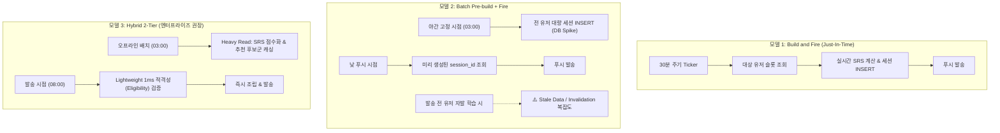

# 대규모 알림 시스템의 세션 빌딩 아키텍처 비교 분석: JIT vs Pre-build vs Hybrid

## 1. 배경 및 문제 제기
- 수만 명 이상의 사용자를 지원하는 푸시 기반 학습 시스템(CopyLingo 등)에서 학습/퀴즈 세션을 언제 어떻게 빌드하여 발송할 것인가?
- 핵심 접근 방식:
  1. **Build and Fire (Just-In-Time)**: 각 사용자의 푸시 시점(예: 30분 단위 슬롯)에 실시간으로 세션을 생성하여 발송.
  2. **Batch Pre-build + Fire**: 야간 고정 시점(Off-peak)에 전 사용자의 세션을 미리 일괄 생성해두고, 푸시 시점에는 발송만 수행.
- 추가 고려 사항: 전송 인프라(Telegram Bot API 25 msg/s 쓰로틀 vs FCM/APNS 무제한 대량 발송)에 따른 아키텍처 트레이드오프.

---

## 2. 세 가지 아키텍처 모델 비교

---

## 3. 상세 트레이드오프 분석

| 비교 항목 | 모델 1: Build and Fire (JIT) | 모델 2: Batch Pre-build | 모델 3: Hybrid 2-Tier (엔터프라이즈) |
|---|---|---|---|
| **DB 부하 패턴** | **평탄 분산 (Traffic Smoothing)**: 30분 슬롯 및 타임존별 분산 | **야간 스파이크 (Thundering Herd)**: 특정 새벽 시간대 대량 I/O 집중 | **균형 분산**: 무거운 연산은 야간 오프라인, 발송 시점은 초경량 읽기 |
| **SRS 데이터 최신성** | **완벽 (100% Fresh)**: 발송 직전의 SRS Due 및 최신 학습 상태 반영 | **오염 위험 (Stale State)**: 선빌드 후 유저가 자발 학습 시 이미 빌드된 세션 내용 오염 | **완벽 (100% Fresh)**: 후보군에서 발송 직전 최종 적격성(Eligibility) 필터링 |
| **자원 효율성** | **우수**: 백로그 상한 초과 유저 및 비활성 유저는 빌드 스킵 (Zero Waste) | **낮음**: 유저의 실제 접속/완료 여부와 무관하게 모든 유저 세션 사전 DB INSERT | **우수**: 후보군 캐시만 유지하며 실제 세션 쓰기는 필요 시에만 수행 |
| **전송 채널 제약 시 (Telegram 25 msg/s)** | **최적**: 초당 25건 발송 파이프라인에 맞춰 DB에 25 TPS의 극히 가벼운 부하만 유발 | **비효율**: 야간에 대량 쓰기를 하고, 낮에는 초당 25건씩 천천히 발송 | 현재 규모에서는 과도한 엔지니어링 (YAGNI) |
| **전송 채널 제약 부재 시 (FCM 대량 발송)** | **피크 병목 위험**: 피크 시각(08:00) 동시 3만 명 빌드 시 DB 커넥션 고갈 | **발송 속도 극대화**: 이미 빌드되어 있으므로 읽기 복제본(Read Replica)으로 즉시 대량 발송 가능 | **최적**: 피크 시각 DB 쓰기 폭발 방지 + SRS 정합성 100% 양립 |

---

## 4. 시니어 엔지니어 관점의 핵심 인사이트

### 1) 외부 병목과 내부 부하의 결합 (Rate Limit Alignment)
- 시스템의 전체 처리율(Throughput)은 **가장 느린 컴포넌트(Bottleneck)**에 수렴한다.
- 텔레그램 환경(25 msg/s)에서는 아무리 DB가 빠르거나 세션을 미리 만들어두어도 발송 속도가 초당 25건으로 제한된다.
- 따라서 발송 파이프라인 속도(25 msg/s)에 맞춰 실시간으로 빌드하는 `Build and Fire`가 DB 커넥션 풀을 가장 균일하고 평탄하게 소모한다.

### 2) 에듀테크 / SRS(간격 반복 학습) 도메인의 특수성: "Cache Invalidation의 함정"
- E-Commerce(장바구니)나 결제 시스템과 달리, 언어 학습 시스템은 **"직전 학습 이력"**이 다음 학습 세션 구성에 결정적인 영향을 미친다.
- 선빌드(Pre-build)를 도입하면 **"알림 발송 전 유저가 자발적으로 앱에 들어와 복습했을 때"** 이미 생성된 미래 세션을 찾아 취소하거나 재조립해야 하는 분산 트랜잭션/이벤트 무효화(Outbox) 복잡도가 기하급수적으로 증가한다.

### 3) 채널 쓰로틀이 사라질 때의 로드맵: Hybrid 2-Tier
- 모바일 앱(FCM/APNS)으로 전환하여 초당 수만 건을 일괄 발송할 수 있게 된다면:
  - `Build and Fire`는 피크 시각(출근길 08:00) DB Write Thundering Herd에 직면하고,
  - `Pre-build`는 여전히 SRS 정합성 오염 문제를 안게 된다.
- 이때의 정답은 Duolingo, Netflix가 사용하는 **Hybrid 2-Tier 아키텍처**다:
  1. **Tier 1 (Offline Batch)**: 유저별 추천 문제/복습 우선순위 점수(Score)만 가볍게 사전 계산하여 Redis/키-값 저장소에 캐싱.
  2. **Tier 2 (Real-time JIT)**: 발송 정각에 1ms 단위로 유저의 오늘 학습 완료 여부만 검증(Eligibility Check) 후 즉시 조립 및 발송.

---

## 5. 결론
- **CopyLingo 현재 아키텍처 (10,000+ 유저, Telegram Bot)**:
  - **Just-In-Time Build & Fire + Worker Pool/Token Limiter (ADR-048)**가 복잡도 없이 데이터 정합성과 성능을 완벽히 만족하는 최적의 설계이다.
- **향후 엔터프라이즈/모바일 푸시 확장 시**:
  - 후보군 사전 집계(Pre-compute) + 발송 시점 검증(JIT Validation)의 **하이브리드 2-Tier 아키텍처**로 진화시키는 것이 올바른 방향이다.
