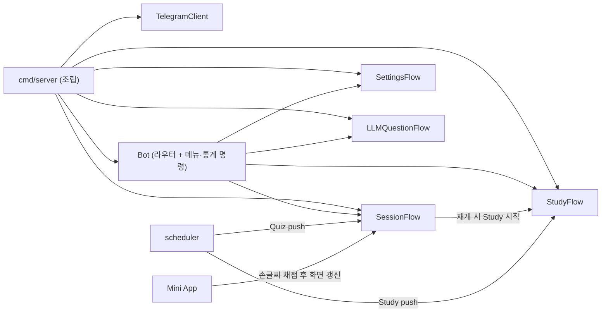

# ADR-059 §8 C단계 구현 계획: 기능별 Flow 분리와 `*Bot` 역참조 제거

- 상태: 설계 판단 3건 확정, 계획 승인 완료(2026-10-01), 구현 중
- 기준 문서: [ADR-059 §3 3단계·§8.3·§8.5](../adr/ADR-059_architecture_simplification.md#85-세분화된-실행-순서)
- 직전 단계: [B단계 workthrough](../workthrough/2609/2609300127_adr059_stage_b_session_service.md)

## 1. 목표

bot 패키지의 어떤 struct 필드에도 `*Bot`·`*service.Services`가 없다(§8.5 C 완료 기준). scheduler·Mini App은 `*Bot` 대신 Flow의 좁은 계약을 받는다.



## 2. 확정된 설계 판단 (2026-10-01, 사용자 결정)

| 항목 | 결정 |
|---|---|
| Flow 분리 범위 | Session·Study에 더해 **Settings·LLMQuestion도 Flow로 분리**한다. Bot은 라우팅과 메뉴·통계·streak·help·exit·study·test 명령만 남긴다. |
| 조립 위치 | **cmd/server**가 `TelegramClient` → 각 Flow → `Bot`(라우터)을 만들고 scheduler·Mini App에 Flow를 직접 주입한다. `NewBot` 내부 조립·getter 방식은 쓰지 않는다. |
| Mini App 키보드 | **C단계에 포함**한다. Mini App은 좁은 계약만 호출하고, 메시지 조회·`QuizProgress` 재조회·키보드 구성·Edit는 `SessionFlow`가 한다(ADR-059 §3 "봇이 Telegram 표현을 소유"). |

계획서 작성 시 함께 고정한 규칙(ADR·B단계 선례를 따름):

- Flow Deps 필드는 **bot 패키지가 정의한 unexported 인터페이스**다. Mini App의 `quizSession` 선례를 따른다. cmd/server는 `*service.SessionService` 등 concrete 값을 넣는다.
- 위치 인자가 4개를 넘으면 `XxxDeps` struct를 쓴다(§8.3).
- `bot.StateStores`(5필드가 모두 같은 `interactions`)는 삭제한다. 각 Flow Deps가 필요한 store만 받는다(§8.1 마지막 항목).
- `cfg`는 Flow에 넘기지 않는다. 필요한 값(`PublicBaseURL`)만 넘긴다.
- scheduler의 `*service.Services` 인자와 cmd/server의 `Services` 묶음은 그대로 둔다. 이것은 D단계 범위다.

## 3. Discovery 결과 (2026-10-01, commit f35f8a5 기준)

### 역참조와 교차 호출

- `SessionFlow{bot *Bot, telegram}`·`StudyFlow{bot *Bot, telegram}`는 `sf.bot.services.*`·`sf.bot.input/drafts/messages/timing`·`sf.bot.cfg.Server.PublicBaseURL`·`sf.bot.isLLMAllowed`를 사용한다.
- SessionFlow → StudyFlow: `session_flow.go:187-190`이 `sf.bot.study`를 lazy-init한 뒤 `startSession`을 호출한다(재개 경로). 반대 방향 호출은 없다.
- Flow → Bot 메서드: `isLLMAllowed`를 `session_answer.go:250`, `session_flow.go:484`, `study_flow.go:426,542`에서 쓰고, `materialPreferenceError`를 `material_preference.go:287,306`에서 쓴다.
  - `isLLMAllowed`는 패키지 변수 `llmAllowedTelegramUserIDs`만 쓴다 → 패키지 함수로 바꾼다.
  - `materialPreferenceError`는 `b.telegram`만 쓴다 → `*TelegramClient`를 받는 패키지 함수로 바꾼다.
- `nil` 방어 분기(`sf.bot == nil || sf.bot.services == nil` 등)가 `word_order.go:270`, `study_flow.go:428,549`, `session_question.go:210`, `llm_question.go:160,258,291`에 있다. 생성자에서 Deps를 채우면 필요 없는 분기이므로 정리한다. 단, 테스트가 일부 의존을 비워 두는 경우가 있으니 테스트를 확인하고 지운다.

### 수신자별 메서드 (테스트 제외)

| 파일 | 현재 수신자 | C단계 후 |
|---|---|---|
| `handler.go` | Bot 18 | Bot(라우터·명령). `PushSession`·`PushStudySession`·`EditMessageReplyMarkup` 삭제 |
| `settings.go` | Bot 5 | SettingsFlow |
| `material_preference.go` | Bot 3 / SessionFlow 1 / StudyFlow 1 | Bot 3개(`settingsKeyboard`·`handleMaterialPreferencesCallback`·`materialPreferenceError`) → SettingsFlow(마지막은 패키지 함수). Flow 메서드는 그대로 |
| `llm_question.go` | Bot 6 | LLMQuestionFlow. `isLLMAllowed`·`telegramUserID`·`telegramUsername`은 패키지 함수 |
| `restart_recovery.go` | Bot 1 | SessionFlow(`RefreshStaleMiniAppMessages`; `showQuestion`·recovery·messages store를 이미 SessionFlow 쪽에서 씀) |
| `session_*.go`, `word_order.go` | SessionFlow | 그대로 |
| `study_flow.go` | StudyFlow | 그대로 |

### Flow별 의존 (현재 사용 기준)

| Flow | service 메서드 | store·값 |
|---|---|---|
| SessionFlow | Session: `StartQuiz`·`ShowQuizQuestion`·`SubmitQuizOption`·`SubmitQuizText`·`SubmitQuizWordOrder`·`CompleteQuiz`·`BuildReviewQuiz`·`ListByStatus`·`QuizProgress`·`ListInProgressQuizzes`(복구) / User: `GetUser` / MaterialPreference / Audio: `GetClip`·`CacheFileID` | Input(ActiveQuestion·SetLLMPending), Drafts, Messages(손글씨 메시지 Save·Get), Recovery, Timing, `PublicBaseURL`, Study 시작 계약 |
| StudyFlow | Session: `StartStudy`·`MarkStudied`·`FinishStudy`·`CompleteStudy`·`StudyProgress` / MaterialPreference | Input(SetLLMPending) |
| SettingsFlow | User: `GetUser`·`UpdateSlotTime`·`UpdateTimezone` / MaterialPreference: `List`·`Get`·`Set` | — |
| LLMQuestionFlow | User: `GetUser` / LLMQuestion: `Answer` / Session: `QuizProgress`·`StudyProgress` | Input(LLM pending Set·Take·Delete) |
| Bot(라우터) | User: `GetUser` / Session: `DueReviewCount`·`BuildStudy`·`BuildMorningQuiz` / Analyzer: `GetUserStats` | Input(`ClearInput`), 4개 Flow |

표는 grep 집계라 구현 시 컴파일러로 최종 확인한다. 인터페이스에는 실제로 호출하는 메서드만 넣는다.

### 외부 소비자

- scheduler: `sessionPusher{PushSession(ctx, chatID, sessionID, sessionType); PushStudySession(ctx, chatID, sessionID)}`를 `*Bot`이 구현한다(`scheduler.go:28`). `dispatcher.go:218,245,303,327`에서 호출한다. `scheduler.New`는 이미 위치 인자가 5개다.
- Mini App: `TelegramMessenger{EditMessageReplyMarkup}`를 `*Bot`이 구현한다. `handler.go:339-485` `refreshHandwritingMessage`는 store로 메시지를 조회하고, `QuizProgress`로 재조회하고, `tgbotapi` 키보드("다음 문제 →" + 자료 연결 시 "⚙️ 연결 자료 설정")를 만든 뒤 Edit한다. `handler.go:287`에서 goroutine으로 호출하고 15초 timeout을 쓴다. `RegisterRoutes(r, cfg, services, handwritingMessages, messenger)`.
- cmd/server: `server.go:31-74`가 `bot.NewBot(cfg, services, bot.StateStores{...})`를 호출하고 `Start`·`RefreshStaleMiniAppMessages`를 실행한다. scheduler와 `router.go:60`에 `*bot.Bot`을 넘긴다.

### 테스트

- bot 테스트에서 `&Bot{...}`·`NewSessionFlow(`·`NewStudyFlow(`를 쓰는 곳이 약 105군데(15개 파일, 총 8.6k줄). `test_common_test.go`에 `newTestSessionService`·`answerByText` 헬퍼가 있다.
- Flow별 테스트 조립 헬퍼(예: `newTestSessionFlow(deps)`)를 먼저 만들고 사이트를 옮긴다. 기계적 치환이 많아 executor 위임 후보다(설계 판단은 넘기지 않는다).

## 4. 목표 형태

```go
// bot
type TelegramClient struct{ api BotAPI }            // telegramClient → export
func NewTelegramClient(token string, debug bool) (*TelegramClient, error)

type SessionFlowDeps struct {
    Telegram           *TelegramClient
    Session            quizSession            // bot 정의 인터페이스
    User               userReader
    MaterialPreference materialPreferences
    Audio              listeningAudio
    Input              quizInputStore
    Drafts             WordOrderDraftStore
    Messages           HandwritingMessageStore
    Recovery           MiniAppRecoveryStore
    Timing             QuestionTimingStore
    Study              *StudyFlow             // 재개 경로. lazy-init 제거
    PublicBaseURL      string
}
func NewSessionFlow(deps SessionFlowDeps) *SessionFlow
// StudyFlowDeps, SettingsFlowDeps, LLMQuestionFlowDeps, BotDeps 동일 방식

// SessionFlow가 Mini App 계약을 구현한다 (이름은 예시)
func (sf *SessionFlow) ShowHandwritingGraded(ctx context.Context, sessionID, questionID int)
func (sf *SessionFlow) RefreshStaleMiniAppMessages(ctx context.Context)

// scheduler
type quizPusher interface { PushSession(ctx, chatID int64, sessionID int, sessionType string) error }
type studyPusher interface { PushSession(ctx, chatID int64, sessionID int) error }
type Deps struct { Services; QuizPusher; StudyPusher; Orchestrator; Cron; Claims }  // 인자 6개 → Deps

// miniapp
type handwritingScreen interface { ShowHandwritingGraded(ctx context.Context, sessionID, questionID int) }
// HandlerDeps: Messenger·HandwritingMessages 제거, HandwritingScreen 추가
// RegisterRoutes(r, cfg, services, handwritingScreen)
```

- Mini App은 goroutine·15초 timeout·`source=miniapp.handwriting.cleanup` 속성 부여를 유지하고 계약만 호출한다. 메시지 조회 실패·재조회 실패·문항 없음·Edit 실패 로그는 SessionFlow로 옮긴다. event 이름(`handwriting.cleanup.*`)은 유지한다.
- 키보드 생성 코드는 SessionFlow의 기존 키보드 helper 옆에 둔다. 문구는 `bot_messages`로 옮길지 확인한다(기존 하드코딩 문구 유지가 기본).
- Mini App `quizSession`에서 `QuizProgress`가 더 이상 쓰이지 않으면 인터페이스에서 뺀다. `tgbotapi`·`callback` import와 `HandwritingMessageStore` 인터페이스를 제거한다.
- cmd/server에서 조립 결과를 묶는 struct는 조립부 안에서만 쓴다(§8.3).

## 5. 커밋 순서

각 커밋마다 수정한 Go 파일에 gofmt·`goparams`를 적용하고 `make test`를 실행한다. 커밋은 로컬에만 한다.

| # | 커밋 | 내용 |
|---|---|---|
| 0 | style | 이번에 수정할 파일 중 goparams 미적용 파일이 있으면 포맷만 분리 |
| 1 | Flow 독립 | `isLLMAllowed`·`materialPreferenceError` 패키지 함수화. `SessionFlowDeps`·`StudyFlowDeps` 도입, `bot *Bot` 필드 제거, lazy-init 제거. `RefreshStaleMiniAppMessages`를 SessionFlow로 이동. 이 시점에는 `NewBot`이 자기 필드로 Flow를 조립한다(임시) |
| 2 | Settings·LLM 분리 | `SettingsFlow`·`LLMQuestionFlow` 도입. Bot 필드를 `BotDeps`의 좁은 필드로 교체하고 `services`·`cfg`·`StateStores`를 제거 |
| 3 | 조립 이동 + 외부 계약 | `TelegramClient` export, cmd/server가 조립. scheduler `Deps` + `quizPusher`/`studyPusher`. Mini App 키보드를 SessionFlow로 이동. `Bot.PushSession`·`PushStudySession`·`EditMessageReplyMarkup` 삭제 |
| 4 | docs | workthrough, ADR-059 상태 줄·§8.7(C단계 구현 결정), STATUS 진행 중 줄, 이 계획서 삭제 |

커밋 1·2가 너무 커지면(테스트 105곳) 테스트 헬퍼 도입을 별도 커밋으로 먼저 뺄 수 있다.

## 6. 보존 제약

- 동작 변경 없음: 화면 문구, callback 규약, 로그 event 이름(이동만), Redis 키·TTL, scheduler claim·worker·rate limit.
- Mini App 손글씨 갱신의 재조회 방식(B단계 보존 정책)을 유지한다. 위치만 bot으로 옮긴다.
- 텍스트·선택지·어순 답안 경로의 소유자 확인은 추가하지 않는다(2026-10-01 사용자 결정: 그대로 둠).
- `Services` 묶음 삭제, `external` 생성 이동, `config` import 정리는 D단계다. 당겨오지 않는다.
- SessionFlow 이름 변경(QuizFlow 등)은 하지 않는다.

## 7. 완료 확인

- `grep -n "\*Bot\b\|\*service.Services" internal/bot/*.go`(테스트 제외) 결과가 struct 필드에서 0건.
- `internal/miniapp`이 `tgbotapi`·`callback`을 import하지 않는다.
- `make test` 통과, `make restart-app` 후 `/health` healthy, 기동 로그에 WARN/ERROR 없음.
- 수동 확인 후보(사용자): 손글씨 제출 후 "다음 문제 →" 버튼 갱신, 예약 push 1회.

## 8. 계획에 없는 판단

이 계획에 없는 설계 판단이 생기면 그 부분만 멈추고 사용자에게 질문한다. 예시는 다음과 같다.

- Flow 간 공용 helper의 소유 위치
- 테스트 헬퍼 구조가 Flow 4개에 공통인지
