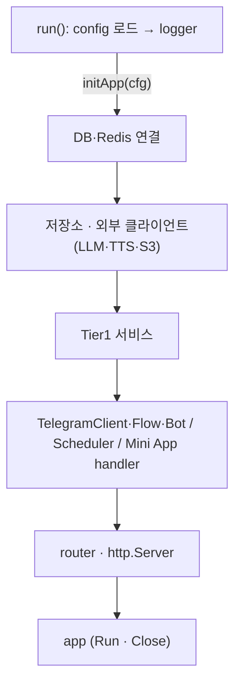

# ADR-059 §8 D단계 구현 계획: `Services` 묶음 삭제와 서버 조립·생명주기 정리

- 상태: Discovery 완료(2026-10-04, `a3ca03a` 기준). 설계 판단 4건 확정, 계획 승인 완료(2026-10-04), 구현 중
- 기준 문서: [ADR-059 §4·§8.3·§8.4·§8.5 D 행·§8.6.1·§8.7](../adr/ADR-059_architecture_simplification.md#85-세분화된-실행-순서)
- 직전 단계: [C단계 workthrough](../workthrough/2610/2610042335_adr059_stage_c_feature_flows.md)

## 1. 목표

cmd/server 한 곳에서 생성 순서를 확인할 수 있다. bot·scheduler·miniapp은 `service.Services` 묶음 대신 좁은 계약만 받는다. 하위 계층(repository·redisstore·external)은 `config`를 import하지 않는다(§8.5 D 완료 기준).



## 2. 설계 판단

### 2.1 확정된 설계 판단 (2026-10-04, 사용자 결정)

| # | 항목 | 결정 | 근거 |
|---|---|---|---|
| Q1 | 서비스 전달 | cmd/server 내부 unexported `services` struct. `newServices(...)`가 Tier1을 만들고, initApp이 bot·scheduler·Mini App을 조립할 때 필드를 하나씩 넘긴다. | `botComponents` 선례와 §8.3("묶음 struct는 cmd/server 조립 중에만"). 소비자 패키지는 묶음을 보지 않는다. initApp에 모두 펼치는 안은 initApp이 약 200줄이 되어 기각. |
| Q2 | LLM client 연결 | `NewLLMClient`가 `*DefaultLLMClient`를 반환한다. `external.LLMClient` 인터페이스와 Tier2 `llmService`를 삭제하고, client 하나를 `SessionDeps.LLM`·`NewTipService`·`NewLLMQuestionService`에 넘긴다. `"answer llm learning question"` wrap은 `LLMQuestionService.Answer`로 옮긴다. | §3.3: `llmService`는 nil 검사만 하는 전달 계층이고 그 nil 분기는 도달하지 않는다. cmd/server는 unexported `newLLMService`를 부를 수 없어 어느 쪽이든 삭제된다. 그러면 `external.LLMClient`는 소비자 없는 생산자 측 선언이 된다. 서비스는 이미 소비자 정의 인터페이스(`QuizGradingLLM`·`tipGeneratorLLM`·`LearningQuestionLLM`)로 범위를 좁힌다. §8.4("인터페이스에 정식 포함")와 방법이 다르므로 §8.8에 기록한다. |
| Q3 | `app` 시작·종료 | `initApp(cfg) (*app, error)`, `app.Run(ctx) error`, `app.Close()`. `run()`이 `signal.NotifyContext`로 ctx를 만든다. Run은 scheduler → bot polling → 재시작 Mini App 갱신(Run ctx) → HTTP 순으로 시작한다. ctx 취소 또는 HTTP listen 실패 시 bot.Stop → `srv.Shutdown`(10초) → scheduler.Stop 후 반환한다. Close는 DB → Redis 순(현재 순서). HTTP listen 실패는 goroutine 안의 `log.Fatalf` 대신 Run 오류로 반환해 정리를 거친다. app 필드는 cmd/server 내부 작은 인터페이스(`Start`/`Stop`)로 두고 fake로 순서를 테스트한다. | ADR §4 "초기화 중간 실패 시 이미 연 자원을 정리하고, 정상 종료 시 작업 중단과 연결 종료 순서를 명확히 한다", §7 "초기화 실패 시 정리와 정상 시작·종료도 확인한다". 종료 코드는 main의 `log.Fatalf`로 같다. |
| Q4 | SessionFlow 이름 변경 | D에 넣지 않는다(이름 유지). | SessionFlow는 Quiz 진행 외에 모드와 무관한 세션 목록·재개(`getPendingSessions`·`getInProgressSessions`·`HandleSessionCallback`·`StartStudy`→StudyFlow 위임)를 맡는다. QuizFlow로 바꾸면 이름이 책임과 어긋나고, 맞추려면 책임 이동이 필요하다. 이는 D 목표(조립·설정 경계) 밖이다. |

### 2.2 선례·ADR로 고정하는 규칙

- **세션 상태**: `config.SessionStatus`와 상수 3개를 삭제한다. `model.SessionStatus`·`model.SessionPending`·`model.SessionInProgress`를 쓴다. 문자열 값은 같다. `config/constants.go`에는 경로 상수만 남는다.
- **external 생성자**: `*config.Config` 대신 options struct를 받는다(`observability.LoggerOptions` 선례). `LLMOptions{APIKey, BaseURL, Model}`, `TTSOptions{APIKey, BaseURL, Model, Voice, VoiceB}`, `S3Options{Endpoint, Region, Bucket, AccessKey, SecretKey, UsePathStyle}`. cfg → options 매핑은 cmd/server와 `cmd/admin/generate_listening_audio`가 한다.
- **Audio 선택 의존**: 생성 조건(`cfg.LLM.APIKey != ""`)을 그대로 cmd/server로 옮긴다. nil이면 `SessionFlowDeps.Audio`와 scheduler `Deps.Audio`에 넣지 않는다(typed-nil 방지, §8.7 nil 방어 행).
- **scheduler**: `Deps{User, Session, Tip, Audio, QuizPusher, StudyPusher, Orchestrator, Cron, Claims}`. 각 서비스 필드는 scheduler가 정의한 unexported 인터페이스이며 실제 호출 메서드만 넣는다. dispatcher는 `BuildForSlot`·`OldestUnfinished`만 받는다. User·Session·Tip nil 분기는 제거하고 Audio nil 분기는 유지한다(§8.7 nil 방어 선례).
- **Mini App**: `RegisterRoutes(r *gin.Engine, handler *Handler)`. cmd/server가 `NewHandler(HandlerDeps{Session, Tip, Verifier: NewInitDataVerifier(token, 24*time.Hour), HandwritingScreen})`를 만든다.
- **router**: ADR §4 예시대로 준비된 핸들러만 등록한다. health handler는 cmd/server가 db·rdb로 만든다. gin release mode 판단은 기존과 같다.
- **콘텐츠 수집**: `initPipeline`은 `*service.ContentService`를 받도록 시그니처만 바꾼다. 기동 시 ContentService를 만들지 않는다(ADR-057 "자동 수집 파이프라인은 시작 시 만들지 않으며, 관련 생성·실행 코드는 재도입을 위해 유지").
- **bot 테스트 조립**: `newTestBot`의 `*service.Services` 인자를 test-local struct(같은 필드 이름)로 바꾼다. call site 8곳은 타입 이름만 바뀐다. cmd/server `initBot`과 같은 조립 방식을 유지한다.
- **유지**: `config.Path*` 경로 상수는 bot(Web App 버튼 URL)과 miniapp(경로 등록)이 공유하는 규약이다. §8.4의 금지 대상(하위 계층)이 아니므로 옮기지 않는다. `repository.Repositories`도 유지한다(§8.3).

## 3. Discovery 결과 (2026-10-04, `a3ca03a` 기준)

### 3.1 `Services` 필드별 소비자 (테스트 제외)

| 필드 | 소비자 | 호출 메서드 |
|---|---|---|
| `Content` | cmd/server `initPipeline`(`server.go:194`, 호출되지 않음) | `Save`(`pipeline.Saver`) |
| `User` | `initBot`(SessionFlow·SettingsFlow·LLMQuestionFlow·BotDeps), scheduler `tick` | scheduler: `GetActiveTimezones`·`GetUsersBySlot` |
| `Session` | `initBot`(4개 Deps), scheduler `tick`, dispatcher, Mini App | scheduler: `CountUnfinishedBatch`, dispatcher: `BuildForSlot`·`OldestUnfinished`, Mini App: `SubmitHandwriting` |
| `MaterialPreference` | `initBot`(StudyFlow·SessionFlow·SettingsFlow) | — |
| `Analyzer` | `initBot`(BotDeps) | — |
| `Tip` | scheduler `topUpTips`, Mini App | `TopUpBucket`, `ListActive` |
| `LLMQuestion` | `initBot`(LLMQuestionFlow) | — |
| `Audio` | `initBot`(`!= nil`일 때만), scheduler `topUpAudio`(nil이면 건너뜀) | `TopUpAudio` |

- 묶음을 받는 위치: `scheduler.Deps.Services`(`scheduler.go:59`), `newSessionDispatcher(services, …)`(`dispatcher.go:32`), `miniapp.RegisterRoutes(r, cfg, services, …)`(`handler.go:83`), cmd/server `initApp`·`initBot`·`startWorkers`·`initScheduler`·`setupRouter`·`initPipeline`.
- scheduler의 서비스 nil 검사: `scheduler.go:244`(User → 오류), `:337`(Session → 집계 생략), `:422`(Tip), `:453`(Audio), `dispatcher.go:178,282`(Session).
- 테스트: bot `newTestBot` call site 13곳 중 8곳이 `&service.Services{…}`를 넘긴다(필드 Session·User·Analyzer·LLMQuestion). `newTestBot` 본문은 MaterialPreference·Audio도 읽는다. scheduler `dispatcher_test.go` 4곳.

### 3.2 `config` import 위치 (테스트 제외)

| 계층 | 파일 | 사용 | D 처리 |
|---|---|---|---|
| repository | `session_repo.go:263` | `SessionStatus` | model |
| external | `llm.go:67`, `tts_client.go:54`, `audio_store.go:60` | `*config.Config` | options struct |
| service | `services.go` | `*config.Config` | 파일 삭제(조립 이동) |
| service | `session.go:63`, `session_query.go:39` | `SessionStatus` | model |
| bot | `session_flow.go:62,223,316` | `SessionStatus` | model |
| bot | `session_question.go` | `PathHandwritingMiniApp` | 유지 |
| miniapp | `handler.go:85` | `*config.Config`(Token만), `Path*` | cfg 인자 삭제, `Path*` 유지 |
| cmd | `server/*` 4개, `admin/*` 3개, `ja/seeder` | 조립 | 유지 |

redisstore는 import하지 않는다. 테스트: `bot/session_flow_extended_test.go`·`service/session_builder_test.go`(SessionStatus), `external/llm_error_test.go`(`*config.Config`).

D 완료 후 service 패키지도 `config`를 import하지 않는다.

### 3.3 external 생성자

| 생성자 | 현재 시그니처 | 읽는 설정 | 호출자 |
|---|---|---|---|
| `NewLLMClient` | `(cfg *config.Config) LLMClient` | `LLM.APIKey`·`BaseURL`·`Model` | `services.go:31`, `llm_error_test.go` |
| `NewTTSClient` | `(cfg *config.Config) *GeminiTTSClient` | `LLM.APIKey`·`BaseURL`·`TTSModel`·`TTSVoiceName`·`TTSVoiceNameB` | `services.go:53`, `admin/generate_listening_audio/main.go:80` |
| `NewS3AudioStore` | `(cfg *config.Config) *S3AudioStore` | `Storage.*` 6개 | `services.go:54`, `admin/generate_listening_audio/main.go:81` |
| `NewNHKClient` | `()` | — | `initPipeline` |

- `GenerateTips`는 `*DefaultLLMClient`에만 있다(`llm.go:414`). `NewLLMClient`는 항상 non-nil `*DefaultLLMClient`를 반환하므로 `services.go:37-40`의 단언은 항상 성공하고 nil 분기는 도달하지 않는다.
- `llmService`(`service/llm.go`)의 `s.client == nil` 분기도 같은 이유로 도달하지 않는다. `DefaultLLMClient`의 각 메서드는 client·model이 없으면 스스로 `ErrAIConfigMissing`을 반환한다.
- `external.LLMClient` 인터페이스의 소비자는 `llmService` 하나다. 이 인터페이스를 구현하는 테스트 대역은 `service/llm_test.go`의 `mockLLMClient` 하나다.

### 3.4 `config.SessionStatus` 사용처

- 테스트 제외: `repository/session_repo.go:263`(`GetSessionsByStatus` 인자), `service/session.go:63`(`SessionRepo` 인터페이스), `service/session_query.go:39`(`ListByStatus`), `bot/session_flow.go:62`(인터페이스)·`:223`(Pending)·`:316`(InProgress).
- 테스트: `bot/session_flow_extended_test.go` 7회, `service/session_builder_test.go` 2회.
- `config.SessionStatusCompleted`는 사용처가 없다. `model/session.go:29-36`에 같은 값의 `SessionStatus`(+`expired`)가 이미 있다.

### 3.5 `NewServices` 조립 순서 (`services.go:24-89`)

1. LLM client 1개(채점·질문·팁 공용) → `llmService` wrap
2. concrete 단언으로 `tipLLM`
3. `NewTipService(repos.Tip, tipLLM, cfg.LLM.Model)`
4. `cfg.LLM.APIKey != ""`이면 `NewAudioService(repos.Question, TTS client, S3 store, voiceA, voiceB)`
5. `NewSessionService(SessionDeps{repo 7개, DB, Stores, LLM})`
6. Content·User·MaterialPreference·Analyzer·`LLMQuestion(llm, tip, cfg.LLM.Model)`을 만들어 묶음 반환

cmd/server의 현재 경로:

```text
run → config·logger
    → initInfra(DB·Redis)                       defer: db.Close → rdb.Close
    → initApp: NewRepositories → NewServices → initBot(cfg, services, interactions)
    → startWorkers: initScheduler(services, …) → sched.Start → go bot.Start → go RefreshStaleMiniAppMessages(Background)
                                                defer: sched.Stop
    → setupRouter(cfg, db, rdb, services, sessionFlow) → startHTTPServer(listen 실패 시 goroutine에서 log.Fatalf)
    → waitForShutdown: SIGINT/SIGTERM → bot.Stop → srv.Shutdown(10s)
```

종료 순서: bot.Stop → HTTP Shutdown → scheduler.Stop → DB → Redis → logger.

### 3.6 포맷

수정 예정 파일 중 goparams 미적용: `cmd/server/infra.go`, `internal/external/tts_client.go`·`audio_store.go`·`llm_error_test.go`, `cmd/admin/generate_listening_audio/main.go`. 커밋 1에서 포맷만 분리한다(C단계 `131c4f1` 선례).

## 4. 목표 형태

```go
// external — config import 없음
type LLMOptions struct{ APIKey, BaseURL, Model string }
func NewLLMClient(opts LLMOptions) *DefaultLLMClient
type TTSOptions struct{ APIKey, BaseURL, Model, Voice, VoiceB string }
func NewTTSClient(opts TTSOptions) *GeminiTTSClient
type S3Options struct {
    Endpoint, Region, Bucket, AccessKey, SecretKey string
    UsePathStyle                                   bool
}
func NewS3AudioStore(opts S3Options) *S3AudioStore

// scheduler
type Deps struct {
    User         slotUsers     // GetActiveTimezones, GetUsersBySlot
    Session      slotSessions  // CountUnfinishedBatch, BuildForSlot, OldestUnfinished
    Tip          tipTopUp      // TopUpBucket
    Audio        audioTopUp    // TopUpAudio. TTS key가 없으면 nil
    QuizPusher   quizPusher
    StudyPusher  studyPusher
    Orchestrator *pipeline.Orchestrator
    Cron         *cron.Cron
    Claims       pushClaims
}

// miniapp
func RegisterRoutes(r *gin.Engine, handler *Handler)

// cmd/server
func run() error {
    // config 로드 → logger (기존)
    ctx, stop := signal.NotifyContext(context.Background(), syscall.SIGINT, syscall.SIGTERM)
    defer stop()
    app, err := initApp(cfg)
    if err != nil {
        return err
    }
    defer app.Close()
    return app.Run(ctx)
}

// initApp은 §1 다이어그램 순서로 한 번 연결한다. 중간 실패 시 연 자원을 닫는다.
func initApp(cfg *config.Config) (*app, error)
```

## 5. 커밋 순서

각 커밋은 수정한 Go 파일에 gofmt·goparams를 적용하고 `make test`를 통과한다. 커밋은 로컬에만 한다.

| # | 커밋 | 내용 |
|---|---|---|
| 0 | docs | 이 계획서(확정된 판단 반영) |
| 1 | style | §3.6 파일의 goparams 포맷만 분리 |
| 2 | 세션 상태 | `config.SessionStatus` 삭제, `model.SessionStatus`로 교체(repository·service·bot·테스트). repository의 `config` import 제거 |
| 3 | external 설정 분리 | options struct 도입, Q2 적용(`llmService`·`external.LLMClient` 삭제, wrap 이동, `NewServices`의 단언 제거). `NewServices`·`cmd/admin`이 cfg를 options로 매핑. 이 커밋 후 하위 계층의 `config` import 0건 |
| 4 | scheduler 좁은 계약 | `Deps.Services` → `User`·`Session`·`Tip`·`Audio`. dispatcher 인자 교체, nil 분기 정리. cmd/server는 아직 `services.X`로 채운다(Audio는 `!= nil`일 때만) |
| 5 | Mini App handler 주입 | `RegisterRoutes(r, handler)`. cmd/server가 handler를 만든다 |
| 6 | `Services` 삭제 | `service.Services`·`NewServices`(`services.go`) 삭제. 외부 클라이언트·서비스 생성을 cmd/server로 이동(Q1). `initBot`이 묶음 대신 서비스를 받는다. `newTestBot`·scheduler 테스트 갱신. `initPipeline` 시그니처 변경 |
| 7 | app 생명주기 | `initApp(cfg) (*app, error)`·`Run(ctx)`·`Close()`(Q3). router는 준비된 handler만 등록. 초기화 실패 정리. app 시작·종료 순서 테스트 |
| 8 | docs | workthrough, ADR-059 상태 줄·§8.8(D단계 결정), `ADR_from_41_to_60.md`의 ADR-059 요약 상태(현재 "A·B 완료"에 멈춰 있음), STATUS 진행 중 줄, 이 계획서 삭제 |


## 6. 보존 제약

- 동작 변경 없음: 화면 문구, callback 규약, 로그 event 이름, Redis 키·TTL, scheduler claim·worker·rate limit(C workthrough "보존한 정책").
- LLM client는 채점·질문·팁 생성이 하나를 공유한다. `redisstore.Interactions` 인스턴스는 하나다. 팁의 source model은 `cfg.LLM.Model`이다.
- Audio 생성 조건(`cfg.LLM.APIKey != ""`)과 nil 시 동작(재생 불가 안내, scheduler top-up 생략).
- 기동·종료 로그 문구(`Connected to PostgreSQL`·`Connected to Redis`·`HTTP server starting on port %d`·`Shutting down...`·`Server stopped`)와 종료 순서(bot → HTTP → scheduler → DB → Redis → logger).
- 콘텐츠 자동 수집은 비활성 상태로 둔다(ADR-057·058). scheduler `Orchestrator`는 계속 nil이다.
- 의도한 변경(Q3): HTTP listen 실패가 즉시 종료 대신 정리 후 종료가 된다. 재시작 Mini App 갱신이 종료 시 취소된다.

## 7. 완료 확인

- `grep -rn "service\.Services\|NewServices" --include=*.go .` 0건.
- `go list -f '{{.ImportPath}}: {{join .Imports " "}} {{join .TestImports " "}}' ./internal/repository/... ./internal/redisstore/... ./internal/external/...`에 `internal/config` 0건. `./internal/service/...`도 0건.
- `grep -rn "config\.SessionStatus" --include=*.go .` 0건.
- cmd/server `initApp`이 §1 순서로 읽힌다. bot·scheduler·miniapp 생성자 Deps에 `*config.Config`·묶음 struct가 없다.
- `make test` 통과. `go vet ./cmd/... ./internal/scheduler ./internal/miniapp ./internal/external ./internal/service ./internal/bot`.
- `make restart-app` 후 `/health` healthy, 기동 로그 WARN/ERROR 없음. 이전 프로세스의 종료 로그가 §6 순서인지 확인한다.
- 수동 확인 후보(사용자, C단계에서 이월): 손글씨 제출 후 "다음 문제 →" 버튼 갱신, 예약 push 1회.

## 8. 계획에 없는 판단

이 계획에 없는 설계 판단이 생기면 그 부분만 멈추고 사용자에게 질문한다. 예시는 다음과 같다.

- scheduler·dispatcher 인터페이스를 하나로 둘지 나눌지가 테스트 대역 범위를 바꾸는 경우
- app 테스트를 위해 bot·scheduler 외의 타입에 인터페이스가 더 필요한 경우
- `initApp`이 길어져 단계별 helper 분리가 필요한 경우(ADR §4: 인자 전달만을 위한 중간 함수는 늘리지 않는다)
