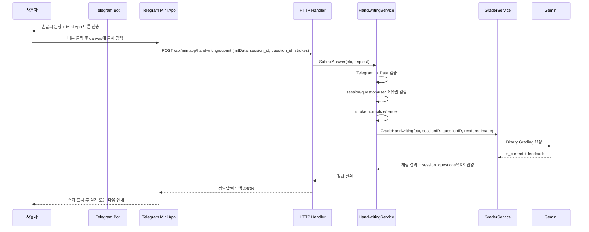

# 작업 기록: 손글씨 가나 문항 구현 방향 ADR 정리

## 작업 목적

히라가나/가타카나 손글씨 문항을 어떤 UX와 채점 구조로 구현할지에 대한 기술적 의사결정을 문서화했습니다.

## 결정 사항

- 손글씨 입력은 Telegram Bot 채팅 UI가 아니라 **Telegram Mini App**에서 처리합니다.
- Bot은 기존 세션 오케스트레이션을 유지하고, 손글씨 문항에서만 Mini App 진입 버튼을 제공합니다.
- Mini App은 완성 이미지 업로드보다 **stroke data 기반 전송**을 우선합니다.
- 채점은 자유 OCR이 아니라 정답을 알고 있는 상태에서의 **Binary Grading**으로 정의합니다.
- Gemini는 open-ended recognition이 아니라 "`정답 문자를 충분히 올바르게 썼는가`"를 판정하는 검증형 호출로 사용합니다.
- 향후 비용 절감을 위해 heuristic/local check 이후 Gemini fallback 구조로 확장 가능하도록 방향을 잡았습니다.

## 결정 배경

- Telegram 기본 봇 인터페이스에는 손글씨 입력 UI가 없습니다.
- 종이에 쓰고 사진을 올리는 방식은 반복 학습 UX가 지나치게 나쁩니다.
- 가나 문항은 정답 후보가 이미 정해져 있으므로 일반 OCR보다 verification 형태가 더 정확하고 경제적입니다.

## 산출물

- `docs/ADR.md`에 `ADR-010` 추가
- `STATUS.md` 최근 완료 내역 업데이트

---

## 구현 플로우 초안

손글씨 문항은 Bot, Mini App, HTTP API, Service, Gemini가 모두 관여하지만, 각 레이어가 직접 서로를 침범하지 않도록 경계를 분리합니다.



## 레이어별 책임

- `internal/bot/session_flow.go`
  - 손글씨 문항인지 판별합니다.
  - 일반 텍스트 입력 안내 대신 `web_app` 버튼을 렌더링합니다.
  - 채점 로직이나 HTTP 호출을 직접 수행하지 않습니다.

- `web/miniapp/handwriting/*`
  - Telegram 내부 WebView에서 실행되는 HTML/CSS/JS입니다.
  - `canvas`에 손가락 또는 마우스 입력을 받고 stroke data를 생성합니다.
  - Telegram `initData`, `session_id`, `question_id`, `strokes`를 서버로 제출합니다.

- `cmd/server/server.go`
  - Mini App 정적 파일과 API route를 등록합니다.
  - 비즈니스 로직은 포함하지 않습니다.

- `internal/miniapp/handler.go`
  - HTTP request/response만 담당합니다.
  - JSON bind, status code mapping, error response formatting만 수행합니다.
  - 실제 검증/채점은 `HandwritingService`에 위임합니다.

- `internal/service/handwriting.go`
  - 손글씨 제출의 orchestration을 담당합니다.
  - Telegram `initData` 검증, 사용자-세션-문항 매칭, 중복 제출 방지, stroke normalize/render, 채점 호출을 조율합니다.
  - Bot이나 HTTP 세부 구현에 의존하지 않습니다.

- `internal/service/grader.go`
  - `GradeHandwriting` 경로를 추가합니다.
  - `session_questions` 기록, 문제 통계, SRS 업데이트는 기존 채점 경로와 동일한 책임으로 유지합니다.

- `internal/external/llm.go`
  - Gemini multimodal binary grading 호출을 담당합니다.
  - 자유 OCR이 아니라 "`이 이미지가 정답 문자 X인가`"를 묻는 검증형 프롬프트를 사용합니다.

## 권장 코드 구조

```text
web/
└── miniapp/
    └── handwriting/
        ├── index.html
        ├── app.js
        └── style.css

internal/
├── miniapp/
│   ├── handler.go        # HTTP endpoint
│   ├── auth.go           # Telegram initData 검증
│   └── types.go          # request/response DTO
├── service/
│   ├── handwriting.go    # 손글씨 제출 orchestration
│   └── grader.go         # GradeHandwriting 추가
└── external/
    └── llm.go            # Gemini multimodal binary grading 추가
```

## Atomic 구현 단계

1. `QuestionType` 추가
   - `kana_handwriting` 타입을 추가합니다.
   - 기존 `fill_blank`, `subjective`와 분리하여 분기 조건을 명확하게 유지합니다.

2. Mini App 설정 추가
   - `server.public_base_url` 또는 `miniapp.base_url` 설정을 추가합니다.
   - Telegram Mini App 버튼은 외부에서 접근 가능한 HTTPS URL이 필요하므로, 로컬 개발 시 tunnel URL을 주입할 수 있어야 합니다.

3. Bot 분기 추가
   - 손글씨 문항이면 `web_app` 버튼을 보여줍니다.
   - URL에는 `session_id`, `question_id`를 포함합니다.
   - Bot은 채점 결과를 기다리거나 직접 HTTP를 호출하지 않습니다.

4. Mini App shell 구현
   - plain HTML/CSS/JS로 `canvas`, `clear`, `submit`만 먼저 구현합니다.
   - 이미지를 직접 보내지 않고 stroke data를 전송합니다.

5. HTTP route/handler 추가
   - `GET /miniapp/handwriting`
   - `POST /api/miniapp/handwriting/submit`
   - Handler는 `HandwritingService.SubmitAnswer`만 호출합니다.

6. Telegram `initData` 검증
   - 서버에서 HMAC 기반 검증을 수행합니다.
   - 검증 실패 시 채점하지 않습니다.

7. Stroke normalize/render
   - stroke data를 서버에서 정규화합니다.
   - Gemini 호출용 소형 raster 이미지로 렌더링합니다.
   - 초기 구현은 단순 bounding box normalize + padding + monochrome PNG로 충분합니다.

8. Gemini binary grading 추가
   - `LLMClient`에 `GradeHandwriting` 메서드를 추가합니다.
   - 프롬프트는 OCR 결과를 묻지 않고, expected character와의 일치 여부를 JSON으로 요구합니다.

9. 채점 기록 연결
   - `GraderService.GradeHandwriting`이 `session_questions`, question stats, SRS를 업데이트합니다.
   - `user_answer`에는 우선 `handwriting:<expected_char>` 형태의 문자열만 저장합니다.
   - stroke raw data 영구 저장은 2차 과제로 둡니다.

10. 테스트 추가
    - `initData` 검증 테스트
    - stroke normalize/render 테스트
    - `HandwritingService` 소유권 검증 테스트
    - `GraderService` 손글씨 분기 테스트

## Tradeoffs

### Option A: 같은 Go 서버에 Mini App과 API를 함께 둔다

- **Pros**: 배포 단순, 기존 Gin 서버 재사용, Bot/Service/Repository DI 재사용 가능
- **Cons**: HTTP route가 늘어나므로 레이어 경계를 지키지 않으면 `cmd/server`가 비대해질 수 있음
- **Recommendation**: 채택. 현재 개인용 프로젝트 규모에서는 별도 프론트엔드/백엔드 분리가 과합니다.

### Option B: Mini App을 별도 프론트엔드 프로젝트로 분리한다

- **Pros**: UI 개발 자유도 높음, 정적 호스팅 가능
- **Cons**: 배포 단위 증가, 환경변수/도메인/CORS 관리 필요
- **Recommendation**: 보류. 손글씨 canvas 하나를 위해서는 과한 구조입니다.

### Option C: Telegram `sendData`만 사용한다

- **Pros**: 별도 submit API 없이 Bot update로 데이터 수신 가능
- **Cons**: payload 제한이 작고, stroke data 확장/재시도/에러 처리에 불리함
- **Recommendation**: 기각. 손글씨 stroke data는 HTTP API가 더 안전합니다.

## 구현 원칙

- Bot과 HTTP Handler는 서로를 호출하지 않습니다.
- Router는 비즈니스 로직을 갖지 않습니다.
- 손글씨 관련 복잡도는 `HandwritingService`로 모읍니다.
- Gemini 호출은 자유 OCR이 아니라 binary verification으로 제한합니다.
- 원본 이미지 업로드가 아니라 stroke-first 전송을 기본값으로 둡니다.
