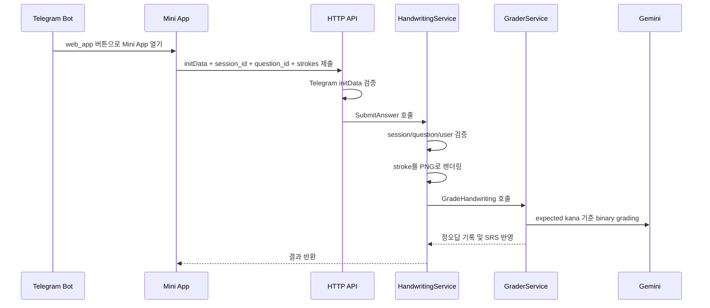

# 작업 기록: 손글씨 가나 Mini App MVP 구현

## 작업 목적

Telegram Mini App을 사용해 히라가나/가타카나 손글씨 문항을 풀고, 서버가 Gemini multimodal binary grading으로 채점하는 1차 MVP 흐름을 구현했습니다.

## 구현 범위

- `kana_handwriting` 문항 타입을 추가했습니다.
- `server.public_base_url` 설정을 추가해 Bot이 Mini App URL을 생성할 수 있게 했습니다.
- Bot 세션 플로우에서 손글씨 문항이면 `web_app` 버튼을 렌더링하도록 분기했습니다.
- 사용자가 손글씨 제출 전 다음 문제로 넘어가지 못하도록 DB 답변 상태 guard를 추가했습니다.
- `web/miniapp/handwriting`에 plain HTML/CSS/JS 기반 canvas Mini App을 추가했습니다.
- Mini App은 PNG 원본이 아니라 stroke data를 서버로 전송합니다.
- `POST /api/miniapp/handwriting/submit` API를 추가했습니다.
- Telegram `initData` HMAC 검증을 추가했습니다.
- `HandwritingService`를 추가해 HTTP와 Bot 사이의 복잡도를 Service layer로 모았습니다.
- stroke data를 서버에서 소형 PNG로 렌더링하는 `PNGStrokeRenderer`를 추가했습니다.
- `LLMClient.GradeHandwriting`을 추가해 Gemini에게 binary verification 방식으로 채점하게 했습니다.
- `GraderService.GradeHandwriting`을 추가해 기존 `session_questions`, question stats, SRS 업데이트 흐름을 재사용했습니다.
- `cmd/ja/kana_seeder`에 손글씨 가나 문항 생성 로직을 추가하고, 기존 가나 맵의 한국어 문자 혼입 오타를 수정했습니다.

## 주요 플로우

## Verification

- `go test ./...` 통과
- `internal/miniapp`에 Telegram `initData` 검증 테스트 추가
- `internal/service`에 stroke PNG 렌더링 테스트 추가

## 남은 작업

- 실제 Telegram BotFather/Web App 도메인 설정 및 HTTPS tunnel 연결 검증
- 실제 Gemini multimodal 응답 품질 확인
- 손글씨 제출 후 Bot 메시지 자동 갱신 여부는 2차 UX 개선으로 보류
- stroke raw data 영구 저장 여부는 분석 요구가 생기면 `answer_meta JSONB` 마이그레이션으로 확장
