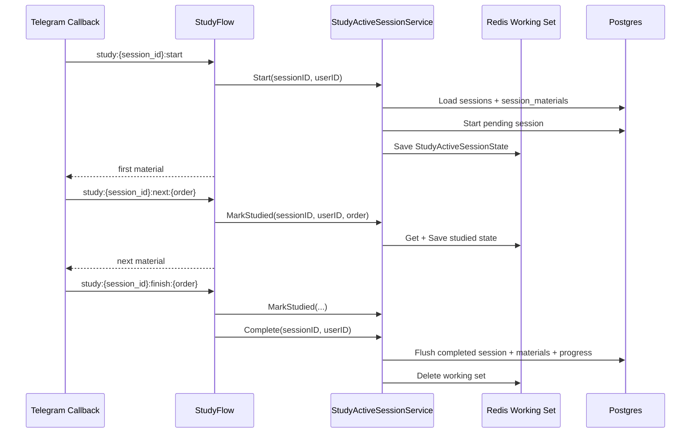

# Study Session Redis Working Set 및 완료 시 Flush 적용

> 작성일: 2026-06-08

## 배경

기존 Study Session 진행 로직은 card를 넘길 때마다 `session_materials.studied_at`과 `user_material_progress`를 DB에 반영하는 구조였다.
Question Session은 Redis Active Session Working Set에 답변 진행 상태를 쌓고 완료 시 flush하는데, Study도 같은 운영 특성이 있다.

## 결정

- Redis get/save/delete lifecycle은 generic `workingSetStore[T]`로 일반화한다.
- Quiz와 Study는 domain 의미가 다르므로 service는 합치지 않는다.
  - Quiz: answer, correct count, SRS scheduler를 다룬다.
  - Study: material exposure, studied mark, material progress flush를 다룬다.
- Study card 이동 callback은 Redis Working Set만 갱신한다.
- Study 완료 callback에서 `sessions`, `session_materials`, `user_material_progress`를 transaction으로 flush한다.
- Redis miss 시에는 DB의 `sessions`와 `session_materials`를 기준으로 Working Set을 복구한다.

## 변경 파일

- `internal/service/working_set.go`
  - Redis Working Set 공통 저장소를 추가했다.
  - state validation, Redis miss, corrupt state 삭제, marshal/unmarshal 처리를 공통화했다.
- `internal/service/active_session.go`
  - 기존 Quiz Active Session의 Redis 직접 접근 로직을 `workingSetStore[model.ActiveSessionState]`로 교체했다.
  - 외부 동작은 유지했다.
- `internal/model/study_active_session.go`
  - Study 진행 상태용 `StudyActiveSessionState`를 추가했다.
  - studied count, 다음 미학습 index, 신규 학습 material id 계산을 model method로 분리했다.
- `internal/service/study_active_session.go`
  - Study Working Set 생성, owner/mode 검증, Redis mark, 완료 flush orchestration을 추가했다.
- `internal/repository/study_active_session_repo.go`
  - DB에서 Study Working Set을 로드하고 완료 시 transaction으로 flush하는 repository를 추가했다.
  - `LoadStudyActiveSession`은 `sessions`, `session_materials`, `materials`를 단일 joined query로 읽고 `s.mode='study'` 조건을 repository layer에서 강제한다.
- `internal/repository/session_material_repo.go`, `internal/repository/material_progress_repo.go`
  - card별 direct DB mark/progress write path를 제거했다.
  - `session_materials` 생성은 `SessionMaterialRepository`, 진행 상태 flush는 `StudyActiveSessionRepository`가 담당한다.
- `internal/bot/study_flow.go`
  - start/next/finish callback이 `StudyActiveSessionService`를 사용하도록 변경했다.
  - `next`는 DB write 없이 Redis state를 갱신하고 다음 card를 표시한다.
- `internal/repository/repositories.go`, `internal/service/services.go`, `internal/config/constants.go`
  - Study Active Session repository/service와 Redis key를 DI graph에 연결했다.
- `internal/bot/study_flow_test.go`, `internal/service/study_active_session_test.go`
  - start, next, finish, incomplete complete rejection 경로를 검증했다.

## 데이터 흐름

## 검증

- `make test` 실행: PASS

## 운영 메모

- App runtime에 반영하려면 Go server restart가 필요하다.
- Redis Working Set TTL은 24시간이다.
- Redis state 유실 시 마지막 DB flush 이전 진행 상태는 복구되지 않고, DB 기준 미학습 card부터 재개된다.
