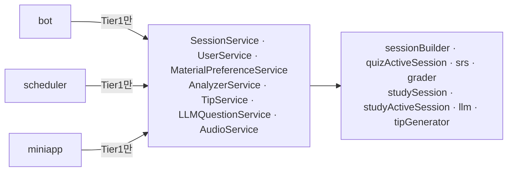

# SessionService Tier1 통합과 Tier2 unexport (ADR-059 §8 B단계)

bot·scheduler·Mini App은 이제 service의 Tier1 타입만 참조한다. Tier2 서비스 8개는 unexported로 바꿨다. 이제 컴파일러가 이 경계를 강제한다. 결정 근거는 [ADR-059 §8.6](../../adr/ADR-059_architecture_simplification.md#86-b단계-세부-결정-2026-09-30)과 §8.6.1에 있다.

## 커밋

| 커밋 | 내용 |
|---|---|
| `d097ad7` docs(adr) | 이전 세션의 §8.2 다이어그램·§8.6·계획서·STATUS 변경을 별도 커밋으로 기록 |
| `7be8da9` style | 수정 대상 중 goparams 미적용 파일 23개의 포맷만 분리 |
| `e996b01` | `SessionService` 뼈대 + Quiz 생성·시작·완료·복습·조회, `SessionQueryService` 흡수 |
| `cf829ef` | Quiz 답안 제출(선택지·텍스트·어순)·손글씨 흡수, Mini App 전환 |
| `7e23cb3` | Study 흡수 + `BuildForSlot` |
| `718eb99` | `TipGenerator` → `TipService`, `LLMQuestionService`, `Services` 필드 정리 |
| `eede352` style(external) | `external/llm.go` 포맷 분리 (다음 커밋이 이 파일의 주석 한 줄을 수정) |
| `768cf70` | Tier2 unexport (순수 rename) |

## 변경

### SessionService가 흡수한 조정 로직

- `StartQuiz`: 조회 → 소유자 확인(`UserID != 0` 조건 유지) → DB 시작 → pending일 때만 재적재. in_progress working set은 DB로 덮어쓰지 않는다.
- `BuildReviewQuiz`: due count → 0이면 `ErrNoDueReviews` → 15개 상한 → 생성. count 오류는 기존대로 0건으로 처리하고 WARN 로그를 추가했다.
- `CompleteQuiz`: word-order 문제 ID 수집(소유자 일치 시) → Flush → streak → Delete. bot은 결과에 담긴 ID로 draft를 지운다.
- `ShowQuizQuestion`: 조회와 커서 이동을 한 번의 Redis 조회로 처리한다. 기존에는 2회 조회했다. Tier2의 `SetCurrentIndex`는 삭제했다.
- `SubmitQuizOption`·`SubmitQuizText`·`SubmitQuizWordOrder`: 현재 미답 문항 확인, 답 정규화(trim, fill-blank 소문자화), 채점, 기록. 주관식 AI 채점 불가 시 오답 대체 기록을 service가 한다(`GradingUnavailable`).
- `SubmitHandwriting`: 기존 `HandwritingService` 흐름을 그대로 옮겼다. AI 채점 불가 시 오류를 반환하고 기록하지 않는다.
- `FinishStudy`: MarkStudied → Complete. 실패한 단계에 따라 sentinel을 반환해 bot 문구(`saveCompletionFailed`·`completeFailed`)를 구분한다.
- `BuildForSlot`: slot에 따라 Study/Quiz 생성으로 분기한다. scheduler는 생성된 세션의 mode에 맞는 push를 호출한다.
- 조회: `ListByStatus`·`ListInProgressQuizzes`·`OldestUnfinished`·`CountUnfinishedBatch`·`DueReviewCount`·`QuizProgress`·`StudyProgress`.

### 기타

- `TipService`가 generator를 내부에서 만들고 `TopUpBucket`을 제공한다. LLM client가 팁 생성을 지원하지 않으면 top-up은 `ErrAIConfigMissing`을 반환한다(기존과 같음).
- `LLMQuestionService.Answer`: LLM 답변 → `TipService`로 팁 후보 저장(best-effort). 문맥 프롬프트 조립·사용자 조회·권한 확인은 bot에 남겼다.
- `service.Services` 필드: `Content, User, Session, MaterialPreference, Analyzer, Tip, LLMQuestion, Audio`.
- Mini App `HandlerDeps`의 `Handwriting`·`QuizActiveSession`을 `Session` 하나(`SubmitHandwriting`+`QuizProgress`)로 합쳤다.
- 미사용 코드 삭제: `SessionQueryService`, `CountUnfinished`(service·repository·쿼리 상수·쿼리 테스트), builder의 pass-through 메서드 6개, `Grader.CompleteSession`.
- `cmd/admin/build_study_sessions`도 `SessionService.BuildStudy`를 사용하게 바꿨다. 그러지 않으면 unexport 후 빌드가 깨진다.

## 계획 대비 달라진 점 (동작·관측)

- **로그 event 통합**: sentinel을 화면 분기 수만큼만 두기로 결정(§8.6.1)하면서, 다음 event가 하나로 합쳐졌다. 원인 단계는 오류 메시지에 남는다.
  - Quiz 시작의 `telegram.session.active_state_lookup_failed`가 `telegram.session.start_failed`로 합쳐졌다.
  - 답안 경로의 `telegram.answer.fallback_record_failed`가 `telegram.answer.grading_failed`로 합쳐졌다. 텍스트 경로의 `telegram.answer.question_not_found` WARN은 없어졌다.
  - 문제 표시의 `telegram.question.index_update_failed`가 `telegram.question.session_lookup_failed`로 합쳐졌다.
  - scheduler의 `scheduler.study_session.empty`가 `scheduler.session.empty`(slot 속성 포함)로 합쳐졌다.
  - 팁 후보 저장 실패 event는 `llm_question.tip_candidate_create_failed`로 바꿨다. service에서 기록하기 때문이다.
- **working set 조회 실패 시 답안 경로**: 질문 시점에 제시한 sentinel 목록에는 텍스트 경로를 "불가 화면"으로 적었다. 구현에서는 기존 동작을 보존했다. 첫 조회 실패 시 텍스트 경로는 메시지를 소비하지 않고(`false`), 선택지 경로는 무시한다. 기존의 "불가 화면"은 두 번째 조회에서만 실패하는 경쟁 상황에서만 나왔다. 조회가 1회로 줄면서 그 경로가 사라졌다.
- **이중 실패 시 안내 문구**: 주관식 AI 채점 불가 후 대체 기록까지 실패하면, 기존에는 "AI 채점 불가" 안내를 먼저 보냈다. 지금은 보내지 않는다(대체 기록 성공 시 순서는 같음).
- **입력 방어**: 음수 선택지 index와 음수 텍스트 문항 index가 panic 대신 무시된다.
- 테스트 `TestHandleSessionCallback`의 callback에 `From`을 넣었다. 실제 Telegram callback에는 `From`이 항상 있고, bot 안에서 합성하는 호출자도 없다.

## 보존한 정책

working set SSOT(in_progress 상태를 DB로 덮어쓰지 않음), ADR-061 트랜잭션(Study 생성), scheduler claim·batch 조회·worker/rate limit, 유형별 채점 실패 정책(주관식 대체 기록 / 손글씨 오류 반환), Quiz 완료만 streak 갱신, due count 오류 0건 처리, Mini App 손글씨 갱신의 재조회 방식.

## 테스트

- service 테스트 추가: `StartQuiz`(pending 재적재·in_progress 보존·소유자 불일치·소유자 0·재적재 실패·DB 시작 실패), `BuildReviewQuiz`(0건·count 오류·15 상한), `ShowQuizQuestion`, `CompleteQuiz`(word-order ID·streak·비소유자), 제출(정답 기록·잘못된 선택지·stale·문항 없음·working set 없음·fill-blank 정규화·주관식 대체 기록과 훅 순서·기타 LLM 오류 미기록·어순 순열 검증), 손글씨(AI 불가 시 오류·미기록 추가), `FinishStudy` 단계별 실패, `BuildForSlot` 분기, `LLMQuestionService`, `TipService` top-up.
- 대체 기록을 검증하던 bot 테스트는 화면(안내 문구·오답 표시)만 검증하도록 바꿨다. `processAnswerText` 직접 호출은 `HandleTextInput` 경로로 대체했다.
- bot 테스트는 `newTestSessionService` 헬퍼로 `SessionService`를 조립한다. repo fake는 `service.SessionRepo` 등을 embed해 필요한 메서드만 구현한다.

## 남은 일 / 미결

- **미결(사용자 판단)**: 텍스트·선택지·어순 답안 경로에는 소유자 확인이 없다. 시작·완료·손글씨에는 있다. B단계에서는 추가하지 않았다. TODO로 분리할지는 사용자가 정한다.
- `graderService.GradeAnswer`·`GradeHandwriting`(문항 조회형)는 이번 변경 전부터 production 호출자가 없었고 테스트에서만 쓴다. 이번에는 그대로 뒀다.
- C단계: 기능별 Flow 분리, `*Bot` 역참조 제거, scheduler·Mini App에 Flow의 좁은 계약 주입.
- D단계: `Services` 묶음 삭제, 외부 클라이언트 생성 이동(`GenerateTips` concrete 단언 제거 포함).

## 검증

- 커밋마다 수정한 Go 파일에 gofmt·`goparams`를 적용하고 `make test`를 실행했다. 모두 통과했다. `eede352`(포맷 전용)는 `go build`로 확인했고, 바로 다음 커밋에서 `make test`를 통과했다.
- `make restart-app`이 성공했고 `http://localhost:8080/health`가 healthy였다. 기동 로그에 WARN/ERROR는 없었다.
