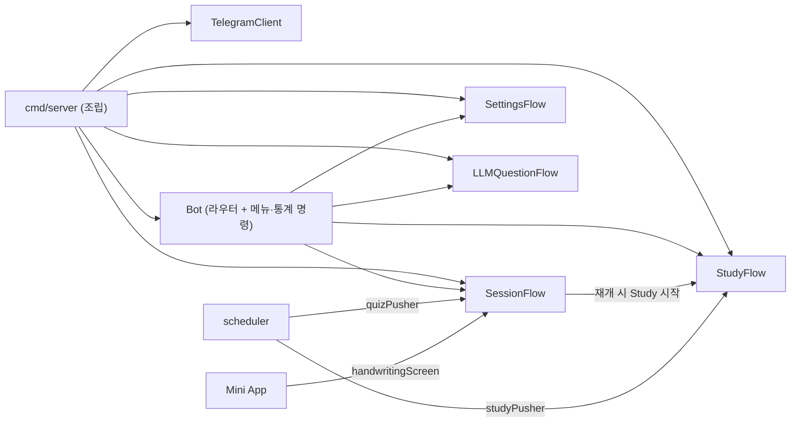

# 기능별 Flow 분리와 `*Bot` 역참조 제거 (ADR-059 §8 C단계)

bot 패키지의 어떤 struct 필드에도 `*Bot`·`*service.Services`가 없다. `Bot`은 update 라우팅과 메뉴·통계·streak·help·exit·study·test 명령만 맡는다. 나머지는 Flow 4개가 맡는다. cmd/server가 `TelegramClient` → 각 Flow → `Bot` 순으로 조립한다. scheduler와 Mini App은 Flow의 좁은 계약만 받는다. 결정 근거는 [ADR-059 §8.7](../../adr/ADR-059_architecture_simplification.md#87-c단계-결정-2026-10-0104)에 있다.

## 커밋

| 커밋 | 내용 |
|---|---|
| `8b5fe6d` docs | 계획서 추가 |
| `131c4f1` style | 수정 대상 중 goparams 미적용 파일(`interactions.go`·`router.go`·`main.go`)의 포맷만 분리 |
| `05cd660` | `SessionFlowDeps`·`StudyFlowDeps` 도입, Flow의 `bot *Bot` 필드와 Study lazy-init 제거. `isLLMAllowed`·`materialPreferenceError` 패키지 함수화 |
| `7b8e49c` docs | 진행 상황과 구현 중 결정(테스트 헬퍼, nil 분기 범위) 기록 |
| `c5e25dc` | `SettingsFlow`·`LLMQuestionFlow` 분리, `Bot`의 `services` 필드를 `BotDeps`의 좁은 인터페이스로 교체 |
| `3723725` | `TelegramClient` export, cmd/server 조립, scheduler `Deps`, Mini App 손글씨 갱신을 SessionFlow로 이동 |

## 변경

### bot

| 타입 | 맡는 일 | Deps |
|---|---|---|
| `Bot` | update 라우팅, 메뉴·통계·streak·help·exit·`/study`·`/test` | `User`·`Session`(`DueReviewCount`·`BuildStudy`·`BuildMorningQuiz`)·`Analyzer`·`Input`(`ClearInput`) + Flow 4개 |
| `SessionFlow` | Quiz 진행, 재시작 복구, 손글씨 채점 후 화면 갱신 | Session·User·MaterialPreference·Audio(선택)·Input·Drafts·Messages·Recovery·Timing·Study·`PublicBaseURL` |
| `StudyFlow` | Study 진행 | Session·MaterialPreference·Input |
| `SettingsFlow` | `/settings`, 알림 시각·timezone, 연결 자료 목록 | User(`GetUser`·`UpdateSlotTime`·`UpdateTimezone`)·MaterialPreference(`List`·`Set`) |
| `LLMQuestionFlow` | `/llm` 활성화·취소·답변, Quiz/Study 문맥 조립 | User·LLMQuestion(`Answer`)·Session(`QuizProgress`·`StudyProgress`)·Input(LLM pending) |

- 모든 Deps 필드는 bot 패키지가 정의한 unexported 인터페이스다. 인터페이스에는 실제로 호출하는 메서드만 넣었다. Flow 간 참조(`Bot`→Flow, `SessionFlow`→`StudyFlow`)는 같은 패키지의 concrete 포인터다.
- `NewTelegramClient(token, debug)`가 토큰 인증과 "authorized as" 로그를 맡는다. `NewBot(BotDeps)`는 이미 조립된 Flow만 받는다.
- 삭제: `StateStores`, `InputStateStore`(소비자가 없어짐), `Bot.PushSession`·`PushStudySession`·`EditMessageReplyMarkup`·`RefreshStaleMiniAppMessages` 위임 메서드, Settings의 `settingsKeyboard`(연결 자료 행을 `buildSettingsKeyboard`에 넣음).
- `SessionFlow.ShowHandwritingGraded(ctx, sessionID, questionID)`: 손글씨 메시지 조회 → `QuizProgress` 재조회 → "다음 문제 →"(+연결 자료) 키보드 → `EditMessageReplyMarkup`. 실패는 반환하지 않고 기존 `handwriting.cleanup.*` event로 로그만 남긴다.

### scheduler

- `New(Deps{Services, QuizPusher, StudyPusher, Orchestrator, Cron, Claims})`. `quizPusher`는 SessionFlow가, `studyPusher`는 StudyFlow가 구현한다. 두 계약 모두 메서드 이름은 `PushSession`이고 인자만 다르다.
- `Services` 필드는 D단계까지 유지한다. §8.3을 임시로 위반하는 부분이며 코드 주석에 적었다.

### Mini App

- `HandlerDeps`: `Messenger`·`HandwritingMessages`·`Config`를 빼고 `HandwritingScreen`을 넣었다. `quizSession`에서 `QuizProgress`를 뺐다. `tgbotapi`·`callback` import가 없어졌다.
- `refreshHandwritingMessage`는 source 속성 부여, 의존 누락 시 `handwriting.cleanup.skipped` WARN, 15초 timeout을 유지하고 계약만 호출한다. 호출 위치(`SubmitHandwriting`의 goroutine)도 그대로다.
- `RegisterRoutes(r, cfg, services, handwritingScreen)`.

### cmd/server

- `initApp` → `initBot(cfg, services, interactions)`이 Flow와 Bot을 조립한다. Audio는 `services.Audio != nil`일 때만 `SessionFlowDeps.Audio`에 넣는다(typed-nil 방지).
- 조립 결과는 cmd/server 안의 `botComponents{router, sessionFlow, studyFlow}`로만 옮긴다. scheduler에는 두 Flow, Mini App에는 SessionFlow, 종료 처리에는 router를 넘긴다.
- Mini App용으로 따로 만들던 `redisstore.NewInteractions(rdb)` 두 번째 인스턴스가 없어졌다.

## 계획 대비 달라진 점

- **`StateStores` 삭제 시점**: 계획서는 커밋 2였지만 커밋 3에서 했다. 커밋 2에서는 `NewBot(cfg, services, stores)` 임시 조립을 유지했기 때문이다. `InputStateStore`도 소비자가 없어져 함께 지웠다.
- **Mini App 키보드 문구**: 계획서는 `handwritingNextButton`과 같은 문구인지 확인하라고 했다. 실제로는 다르다("제출 후 다음 문제 →", 채점 전 버튼). 같은 문구는 `nextQuestionButton`("다음 문제 →")과 `linkedMaterialSettingsButton`("⚙️ 연결 자료 설정")이다. 화면 문구가 같으므로 이 두 키를 재사용했다.
- **nil 분기 제거 결과**: Settings 화면의 연결 자료 버튼은 MaterialPreference 주입 여부와 무관하게 항상 표시된다(production은 항상 주입하므로 동작 변화 없음). 도달할 수 없게 된 "❌ LLM 질문 기능이 준비되지 않았습니다." 문구를 삭제했다.
- **Flow 진입 메서드 이름**: `handleSettingsCommand`·`handleLLM` 등 기존 이름을 유지하고 수신자만 바꿨다.
- **테스트 헬퍼 인자**: `newTestSettingsFlow(api, deps)`는 Settings에 store 의존이 없어 `stores` 인자가 없다. `newTestLLMQuestionFlow(api, stores, deps)`는 다른 Flow 헬퍼와 같은 모양이다.

## 보존한 정책

화면 문구, callback 규약, 로그 event 이름(`handwriting.cleanup.*`는 위치만 이동), Redis 키·TTL, scheduler claim·worker·rate limit, Mini App 손글씨 갱신의 재조회 방식, Audio 선택 의존. 텍스트·선택지·어순 답안 경로의 소유자 확인은 추가하지 않았다(2026-10-01 사용자 결정). SessionFlow 이름은 바꾸지 않았다.

## 테스트

- 추가: `TestShowHandwritingGraded`(현재 문항이면 next·자료 버튼 callback으로 Edit, 지난 문항이거나 저장된 메시지가 없으면 Edit 없음), `TestRefreshHandwritingMessageReportsGradedQuestionWithTimeout`(Mini App이 session·question과 deadline이 있는 ctx로 계약을 호출).
- 변경: Settings 키보드 행 수 6→7, 연결 자료 버튼 테스트는 항상 표시되는지만 확인, `TestEditMessageReplyMarkup` → `TestTelegramClientEditMessageReplyMarkup`, 재시작 복구 테스트는 SessionFlow를 직접 조립. scheduler 테스트 fake는 Quiz/Study 계약으로 나눴다(`mockDispatcherPusher.study()`).
- 삭제: `TestBotPushSession`. `TestPushSession`(SessionFlow)과 검증이 같다.
- 테스트 조립: Flow별 헬퍼 `newTestSessionFlow`·`newTestStudyFlow`·`newTestSettingsFlow`·`newTestLLMQuestionFlow`, 디스패치 테스트용 `newTestBot`(cmd/server와 같은 조립). 공통 fixture struct는 만들지 않았다.

## 남은 일 / 미결

- D단계: `Services` 묶음 삭제(scheduler `Deps.Services`, `miniapp.RegisterRoutes`의 `services`, `initBot`의 `services` 인자), 외부 클라이언트 생성 이동, 필요한 설정 값만 전달(`miniapp.RegisterRoutes`의 `cfg` 포함), 세션 상태 `model` 일원화.
- 사용자 수동 확인 후보: 손글씨 제출 후 "다음 문제 →" 버튼 갱신, 예약 push 1회.

## 검증

- 커밋마다 수정한 Go 파일에 gofmt·`goparams`를 적용하고 `make test`를 실행했다. 모두 통과했다. `3723725`은 `go vet ./internal/bot ./internal/miniapp ./internal/scheduler ./cmd/...`도 통과했다.
- 계획서 §7 완료 기준: bot 패키지(테스트 제외)의 `*Bot`은 수신자·생성자 반환에만 있고, `*service.Services`는 없다. `internal/miniapp`은 `tgbotapi`·`callback`을 import하지 않는다.
- `make restart-app`이 성공했고 `http://localhost:8080/health`가 healthy였다. 기동 로그 6줄에 WARN/ERROR는 없었다.
