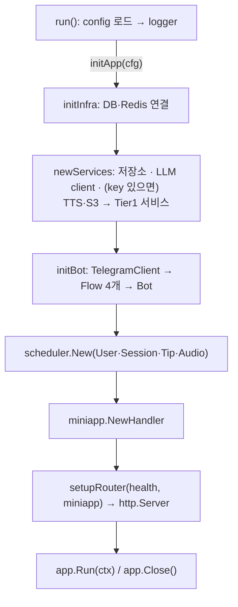

# 서버 조립 일원화와 `Services` 묶음 삭제 (ADR-059 §8 D단계)

cmd/server의 `initApp` 한 곳에서 생성 순서를 확인할 수 있다. bot·scheduler·Mini App은 `service.Services` 대신 각자 정의한 좁은 계약만 받는다. 하위 계층(repository·redisstore·external)과 service 패키지는 `config`를 import하지 않는다. 시작과 종료는 cmd/server 내부의 `app`(`Run`·`Close`)이 맡는다. 결정 근거는 [ADR-059 §8.8](../../adr/ADR-059_architecture_simplification.md#88-d단계-결정-2026-10-0405)에 있다.

종료 순서: SIGINT/SIGTERM → bot 중지 → HTTP Shutdown(10초) → scheduler 중지 → DB → Redis → logger.

## 커밋

| 커밋 | 내용 |
|---|---|
| `08b6ae3` docs | 계획서 추가 |
| `5f43bb2` style | 수정 대상 중 goparams 미적용 파일(external client 2개·`llm_error_test.go`·`infra.go`·`generate_listening_audio`)의 포맷만 분리 |
| `556489f` | `config.SessionStatus` 삭제, `model.SessionStatus`로 교체 |
| `2ecd793` | external options struct, `NewLLMClient`가 concrete 반환, `external.LLMClient`·`llmService` 삭제 |
| `35a2eac` | scheduler `Deps`를 User·Session·Tip·Audio 좁은 계약으로 교체 |
| `c7e439b` style | `miniapp/auth.go` goparams 포맷만 분리 |
| `2f28e68` | `miniapp.RegisterRoutes(r, handler)`, cmd/server가 handler 생성 |
| `4438182` | `service.Services`·`NewServices` 삭제, 서비스 생성을 cmd/server `newServices`로 이동 |
| `5be1e35` | `app`(`initApp`·`Run`·`Close`), router는 준비된 handler만 등록 |
| `b2b05ec` fix | 리뷰 반영: 재시작 Mini App 갱신이 취소된 ctx에서 남은 세션을 건너뜀, `Run` 주석 정정 |

## 변경

### cmd/server

| 파일 | 맡는 일 |
|---|---|
| `main.go` | `run()`: config → logger → `initApp` → `defer Close` → signal ctx → `Run` |
| `app.go` | `app` 타입, `initApp`(조립 순서 전체), `Run`(시작·대기·종료), `Close`(DB → Redis) |
| `services.go` | cmd/server 전용 `services` struct와 `newServices`(저장소·외부 클라이언트·Tier1 생성) |
| `server.go` | `botComponents`, `initBot`(Flow·Bot 조립), `initPipeline`(재연결용 보존) |
| `router.go` | `setupRouter(releaseMode, health, miniappHandler)`, `healthHandler(db, rdb)` |
| `infra.go` | `initInfra`가 연결만 반환한다. 닫기는 `app.Close`가 맡는다 |

- 삭제: `startWorkers`·`initScheduler`·`startHTTPServer`·`waitForShutdown`. 각 역할은 `initApp`(생성)과 `app.Run`(시작·종료)으로 옮겼다.
- `services` struct는 cmd/server 밖으로 나가지 않는다. `initBot`·scheduler·Mini App 조립이 필드를 하나씩 꺼내 쓴다(§8.3, `botComponents` 선례).
- Audio는 `cfg.LLM.APIKey != ""`일 때만 만든다(기존 조건). nil이면 `SessionFlowDeps.Audio`와 `scheduler.Deps.Audio` 모두에 넣지 않는다(typed-nil 방지).
- `app` 필드 중 bot·scheduler·Mini App 갱신은 cmd/server 내부의 작은 인터페이스(`updatePoller`·`jobScheduler`·`miniAppRefresher`)다. 테스트가 fake로 시작·종료 순서를 확인한다.
- `Run`은 HTTP 포트를 먼저 bind하고 그다음 scheduler → bot polling → 재시작 Mini App 갱신 → `Serve`를 시작한다. 포트 충돌이면 아무것도 시작하지 않고 오류를 반환한다. 이전에는 goroutine 안의 `log.Fatalf`로 정리 없이 종료했다.
- 재시작 Mini App 갱신은 `Run`의 ctx로 돈다(이전: `context.Background()`). 종료로 ctx가 취소되면 다음 세션에서 멈춘다(`b2b05ec`). 이 확인이 없으면 남은 세션마다 ERROR 로그나 "세션 없음" 화면이 나갈 수 있었다.
- signal 등록은 `initApp` 성공 후에 한다. 느린 기동 중 Ctrl+C는 이전처럼 기본 동작으로 즉시 종료된다.

### external

- `NewLLMClient(LLMOptions{APIKey, BaseURL, Model}) *DefaultLLMClient`, `NewTTSClient(TTSOptions{APIKey, BaseURL, Model, Voice, VoiceB})`, `NewS3AudioStore(S3Options{Endpoint, Region, Bucket, AccessKey, SecretKey, UsePathStyle})`. cfg → options 매핑은 cmd/server와 `cmd/admin/generate_listening_audio`가 한다.
- 삭제: `external.LLMClient` 인터페이스. 소비자가 Tier2 `llmService` 하나였고, 서비스는 이미 자기 인터페이스(`QuizGradingLLM`·`tipGeneratorLLM`·`LearningQuestionLLM`)로 범위를 좁힌다. 인터페이스 메서드 주석은 `DefaultLLMClient` 메서드로 옮겼다.

### service

- 삭제: `services.go`(`Services`·`NewServices`), `llm.go`(`llmService`). `llmService`의 nil 분기는 `NewLLMClient`가 항상 non-nil을 반환해 도달하지 않았다.
- `GenerateTips` concrete 단언이 사라졌다. cmd/server가 같은 client를 `SessionDeps.LLM`·`NewTipService`·`NewLLMQuestionService`에 넘긴다.
- `LLMQuestionService.Answer`가 LLM 오류를 `"answer llm learning question: %w"`로 감싼다. `llmService`에 있던 wrap을 옮긴 것으로 메시지는 같다.

### scheduler

- `Deps{User, Session, Tip, Audio, QuizPusher, StudyPusher, Orchestrator, Cron, Claims}`. 서비스 필드는 scheduler가 정의한 unexported 인터페이스(`slotUsers`·`slotSessions`·`tipTopUp`·`audioTopUp`)이며 실제 호출 메서드만 넣었다. dispatcher는 `dispatchSessions`(`BuildForSlot`·`OldestUnfinished`)만 받는다.
- User·Session·Tip nil 분기는 제거하고 Audio nil 분기는 유지했다(§8.7 nil 방어 선례). pusher nil 검사는 그대로다.

### Mini App

- `RegisterRoutes(r, handler)`는 경로만 등록한다. cmd/server가 `NewHandler(HandlerDeps{Session, Tip, Verifier, HandwritingScreen})`를 만든다.
- init data 유효 시간을 `miniapp.InitDataMaxAge`(24시간) 상수로 이름 붙였다. 값은 같다.

### 세션 상태

- `config.SessionStatus`와 상수 3개를 삭제하고 `model.SessionStatus`·`SessionPending`·`SessionInProgress`를 쓴다. `config/constants.go`에는 Mini App 경로 상수만 남았다.

## 계획 대비 달라진 점

- **style 커밋 추가**: 계획서 §3.6에 없던 `miniapp/auth.go`를 `InitDataMaxAge` 추가로 수정하게 되어 포맷만 `c7e439b`로 분리했다.
- **listen 먼저**: 계획은 "HTTP listen 실패를 Run 오류로 반환"이었다. 구현은 포트를 먼저 bind해 포트 충돌 시 bot polling을 시작하지 않게 했다. 기동 로그 순서는 같다.
- **signal 등록 위치**: 계획서 §4 스케치는 `initApp` 전이었지만, 기동 중 Ctrl+C 동작을 유지하려고 `initApp` 후로 옮겼다.
- **app 테스트**: http.Server용 인터페이스를 추가하지 않았다. `http.Server.BaseContext`로 실제 listener 주소를 받고 각 Stop 시점에 dial해 HTTP가 열려 있는지 기록한다.
- **오류 메시지**: 초기화 실패는 `failed to init app: failed to init infrastructure: …`처럼 한 단계 더 감싸진다. `Close`는 연결 종료 오류를 로그로 남긴다(이전: 무시).
- **cfg → options 매핑 중복**: cmd/server와 `cmd/admin/generate_listening_audio` 두 main 패키지에 같은 매핑이 있다. 공유하려면 `config`가 `external`을 import하거나 새 패키지가 필요해 두었다.
- **종료 로그 확인 방법**: 계획서 §7은 `make restart-app` 후 이전 프로세스의 종료 로그를 보라고 했다. restart-app은 pane kill·`fuser -k`로 종료해 graceful 경로를 타지 않으므로 server 바이너리에 SIGTERM을 보내 확인했다.

## 보존한 정책

화면 문구, callback 규약, 로그 event 이름, Redis 키·TTL, scheduler claim·worker·rate limit, LLM client 1개 공유(채점·질문·팁), `redisstore.Interactions` 인스턴스 1개, 팁 source model(`cfg.LLM.Model`), Audio 생성 조건과 nil 시 동작, 기동·종료 로그 문구와 종료 순서, 콘텐츠 자동 수집 비활성(ADR-057·058). SessionFlow 이름은 바꾸지 않았다(2026-10-04 사용자 결정).

## 테스트

- 추가
  - `TestAppRunStartsWorkersAndStopsBotThenHTTPThenScheduler`: scheduler → bot 시작, 취소 시 bot 중지(HTTP 열림) → scheduler 중지(HTTP 닫힘), 재시작 갱신 ctx 취소, `Run`이 nil 반환. 종료 순서를 바꾸면 실패하는 것을 확인했다.
  - `TestAppRunReturnsListenErrorWithoutStartingWorkers`: 포트 충돌 시 오류 반환, 아무것도 시작하지 않음.
  - `TestTopUpFillsEachDistinctBucketAndSkipsUnsetAudio`: Tip·Audio top-up이 (언어, 레벨) 쌍마다 한 번씩 호출되고, Audio가 없으면 생략.
  - `TestRefreshStaleMiniAppMessages_StopsWhenContextCancelled`: 취소된 ctx면 세션별 조회·발송을 하지 않음. 확인을 지우면 실패하는 것을 확인했다.
- 변경: `TestNewLLMClient`(options, 타입 단언 제거), `TestLLMQuestionServiceAnswer`의 LLM 실패 케이스가 wrap 메시지도 확인, dispatcher 테스트는 `SessionService`를 직접 넘김, `newTestBot`은 test-local `testServices`를 받음(필드 이름이 같아 call site는 타입 이름만 바뀜).
- 삭제: `service/llm_test.go`. wrap 확인은 `TestLLMQuestionServiceAnswer`로 옮겼다.
- 직접 테스트하지 않은 것: `initApp` 중간 실패 시 연결 정리. 실제 DB·Redis·Telegram 인증이 필요하다. named return `err`와 `defer a.Close()`로 처리한다.

## 남은 일 / 미결

- 종료 시 scheduler는 실행 중인 tick(최대 10분)을, bot은 처리 중인 update goroutine을 기다리지 않는다. 그 사이 `Close`가 DB·Redis를 닫을 수 있다. D 이전부터 같은 동작이며, 기다리게 하려면(`<-cron.Stop().Done()` 등) 종료 시간이 길어지는 별도 결정이 필요하다.
- E단계: `go list` 기반 import 경계 테스트. D 결과 기준 후보 규칙: repository·redisstore·external·service → `config`·`bot`·`miniapp`·`scheduler` import 금지.
- `config.Path*` 경로 상수는 bot·miniapp이 공유하는 규약으로 남겼다(§8.4 금지 대상 아님).
- SessionFlow 이름: 유지. 바꾸려면 모드 무관 세션 목록·재개 책임 분리가 먼저다.
- 사용자 수동 확인 후보(C단계에서 이월): 손글씨 제출 후 "다음 문제 →" 버튼 갱신, 예약 push 1회.
- `docs/todos/03_e2e_test_plan.md`의 하니스 절은 B~D 이전 조립 구조로 쓰여 있다. 낡았다는 경고만 달았고 착수할 때 다시 쓴다. `02_integration_test_plan.md`의 `SessionStatus`·`RegisterRoutes` 참조는 고쳤다.

## 검증

- 커밋마다 수정한 Go 파일에 gofmt·`goparams`를 적용하고 `make test`를 실행했다. 모두 통과했다. `go test -race ./cmd/server -run TestAppRun -count=5`도 통과했다.
- `go vet ./cmd/... ./internal/scheduler ./internal/miniapp ./internal/external ./internal/service ./internal/bot ./internal/repository ./internal/config` 통과.
- 계획서 §7 완료 기준: `service.Services`·`NewServices` 0건, repository·redisstore·external·service의 `config` import(테스트 포함) 0건, `config.SessionStatus` 0건, bot·scheduler·miniapp(테스트 제외)에 `*config.Config`·묶음 struct 0건.
- 독립 리뷰(reviewer): 의도와 다른 구현이나 회귀 없음. 낮은 심각도 2건(재시작 갱신 취소 처리, `Run` 주석)은 `b2b05ec`에서 고쳤다. reviewer가 영향받는 6개 패키지의 `go test -race`도 통과시켰다.
- `make restart-app` 후 `/health` healthy, 기동 로그 6줄에 WARN/ERROR 없음. server 바이너리에 SIGTERM을 보내 `Shutting down...` → `Telegram bot stopped` → `Server stopped` → `Scheduler stopped` 순서와 정상 종료를 확인한 뒤 다시 `make restart-app`으로 띄웠다(healthy).
