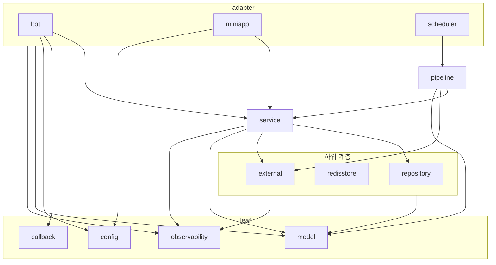

# internal 패키지 import 경계 테스트 (ADR-059 §8 E단계)

`go test ./...`가 internal 패키지의 import 경계를 검사한다. 허용하지 않은 내부 import, 규칙이 없는 새 패키지, 소유 패키지 밖의 드라이버·SDK import는 실패한다. 이로써 ADR-059의 2·3단계(§8 A~E)를 모두 마쳤다.

허용된 내부 import를 그린 그래프다. `model`·`observability`로 가는 화살표는 그룹 단위로 묶었다. 이 화살표 밖의 내부 import가 생기면 테스트가 실패한다.

## 커밋

| 커밋 | 내용 |
|---|---|
| `6288388` | `internal/import_boundary_test.go` 추가 |
| (이 문서) | ADR-059 상태·§8.9, ADR 색인, STATUS, ARCHITECTURE 갱신 |

## 변경

- [`internal/import_boundary_test.go`](../../../internal/import_boundary_test.go)
  - `go list -f '{{.ImportPath}}{{range .Imports}} {{.}}{{end}}' github.com/lsj/copylingo/internal/...`로 각 패키지의 non-test import를 읽는다.
  - `allowedInternalImports`: 패키지별로 import할 수 있는 internal 패키지 목록이다. 패키지가 표에 없거나 import가 목록에 없으면 실패한다. 모듈 안이지만 internal이 아닌 패키지(`cmd/ja/catalog` 등)의 import도 실패로 본다.
  - `driverOwners`: 드라이버·SDK import 경로 prefix별로 import할 수 있는 패키지 목록이다(go-redis → redisstore, `lib/pq` → repository, sqlx → repository·service·testutil, Telegram → bot, go-openai·AWS → external).
  - `internal/` 루트에 둔 테스트 전용 패키지다. 새 패키지 디렉터리는 만들지 않았다.
- ARCHITECTURE.md에 "패키지 import 경계" 절을 추가했다. 규칙의 원본은 테스트의 표이고, 문서는 위치와 갱신 방법만 적었다.

## 결정

ADR-059 §8.9에 기록했다. 요약하면 다음과 같다.

- 금지 목록이 아니라 허용 목록이다. 경계를 바꾸려면 같은 diff에서 표를 고쳐야 하므로 리뷰에서 변경이 보인다.
- `cmd/*`와 `_test.go`는 검사하지 않는다. `cmd/server`는 조립부이고, 테스트는 실제 구현을 조립하면서 다른 계층 타입을 쓴다.
- `external → observability`는 §8.4 "model과 드라이버만"의 유일한 예외다. LLM 호출 로그 속성만 쓴다.
- 저장소에 CI가 없어 `make test` 실패를 완료 기준으로 봤다.

## 착수 시 상태

현재 import 그래프에는 위반이 없었다. 그래서 production 코드는 바꾸지 않았다. 허용 목록은 현재 그래프와 같고, 각 항목의 근거는 테스트 주석과 ADR §5·§8.4·§8.7·§8.8에 있다.

## 검증

- 실패 확인: 위반을 하나씩 담은 임시 파일 3개를 넣고 테스트를 돌렸다. 세 건 모두 실패 메시지로 잡혔고, 임시 파일은 확인 후 삭제했다.
  - `internal/repository`가 `internal/config`를 import → `internal/repository must not import internal/config`
  - `internal/miniapp`이 `telegram-bot-api`를 import → `internal/miniapp must not import github.com/go-telegram-bot-api/telegram-bot-api/v5; only [bot] may`
  - 규칙 없는 새 패키지 `internal/zzmut` → `internal/zzmut has no import rule; add it to allowedInternalImports`
- `goparams` 적용, `golangci-lint run ./internal/` 0 issues, `golangci-lint fmt --diff` 변경 없음.
- `go build ./...` 통과: 테스트 전용 패키지가 빌드에 영향을 주지 않는다.
- `make test` 전체 통과. 새 패키지 `github.com/lsj/copylingo/internal` ok. SKIP 7건은 기존 Postgres 의존 테스트다.
- 앱 재시작은 생략했다. production 코드 변경이 없다.

## 남은 일

- push: 로컬 커밋이 `origin/master`에 없다. 별도 승인이 필요하다.
- D단계에서 넘어온 미결 2건은 그대로 남아 있다: 종료 시 실행 중인 scheduler tick과 Telegram update를 기다리지 않는다, `03_e2e_test_plan.md` 하니스 절이 낡았다.
