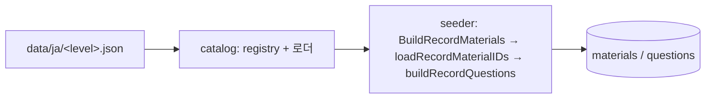

# N5 seed 데이터를 record로 전환하고 seed 때 문항 생성 제거

- 날짜: 2026-10-08
- 계기: N4는 문항을 데이터로 저장하고 N5는 seed 때 생성하는 식으로 level마다 방식이 달랐다. 방식을 하나로 통일하기로 확정했고, 문항 유형은 JLPT 체계를 따르기로 했다.
- 결정: [ADR-067](../../adr/ADR_from_61_to_80.md#adr-067-n5도-record로-전환하고-seed-때-문항을-생성하지-않는다)
- 동작 변화: 없음. seed 결과(material·question)가 변경 전과 key별로 같다.

## 구조

```
cmd/seeding/
  main.go            ← 모든 level을 record로 upsert (경로 하나)
  catalog/           ← record 타입, payload 타입, registry(언어·level·파일)
  data/
    embed.go         ← //go:embed */*.json
    ja/n5.json       ← kana·어휘·문법·독해 material과 그 문항, 최상위 청해
    ja/n4.json
```



## 변경 내역

| 대상 | 내용 |
|---|---|
| `data/ja/n5.json` (신규) | 변환 시점의 seeder 출력을 그대로 저장했다. material 1,117개(kana 208, 어휘 789, 문법 80, 독해 40), 그 안의 문항 3,863개, 최상위 청해 50개다. 변환기 출력 형식이 기존 N4 파일과 byte 단위로 같음을 먼저 확인했다 |
| `data/ja/kana.json`, `n5_*.json` (7개 삭제) | 내용은 `n5.json`과 git 이력에 있다 |
| `data/ja/n4/records.json` → `data/ja/n4.json` | level 디렉토리를 없앴다 |
| `cmd/seeding/main.go` | legacy builder(kana, 어휘, 어휘 문맥, 문법, 청해, 독해, 어순)와 유형별 material ID 조회를 제거했다. 1,990줄에서 355줄이 됐다 |
| `cmd/seeding/catalog/datasets.go` | 유형별 데이터 타입(`VocabWord` 등), 난이도 상수, `KanaMap`, legacy 파일 로딩, 디렉토리 합치기를 제거했다. registry는 level마다 파일 이름 하나를 가진다. 로더는 모르는 필드를 거부한다 |
| `cmd/seeding/catalog/materials.go` | payload 타입과 `BuildRecordMaterials`만 남겼다. legacy material builder, key helper, `ScriptLabel`을 제거했다 |
| `cmd/seeding/catalog/*_test.go` | N5 legacy 데이터 테스트를 record 공통 규칙으로 바꿨다. category별 payload 필수 필드, 선택형 문항은 서로 다른 선지 4개, 난이도 1~10(DB CHECK와 같음), 어순 조각 2개 이상을 검사한다. level별 item type 고정(N5 14종, N4 15종)을 추가했다 |
| `cmd/seeding/main_test.go` | record 경로 테스트만 남겼다 |
| `README.md`, ADR-066·067, STATUS | 데이터 위치와 결정 갱신 |

수정한 Go 파일에 `goparams`를 적용했다.

## 경과

같은 날 B안(오프라인 생성 도구 `cmd/seeding/generate`가 JSON에 문항을 써 두는 방식)을 먼저 구현했다. 생성기 출력과 커밋된 데이터를 비교한 결과, 3,668개 중 2,799개가 같았고 869개는 오답 난수 방식만 달랐다. 그 뒤 문항 유형을 JLPT 체계로 따르기로 하면서 생성기를 쓸 곳이 없어져 패키지째 지웠다. 생성 로직은 HEAD `2b00986`의 `cmd/seeding/main.go`에 남아 있다.

## 검증

- seed 출력 비교: 변경 전(HEAD `2b00986`)과 후의 전체 seed 출력을 dump했다. material ID는 가짜 store로 넣었다. material은 `material_key`, question은 `question_key` 기준으로 비교했고, `material_id`는 material_key로 바꿔 비교했다. 결과: material 2,242개, question 5,318개, key 차이 0, 필드 차이 0. 파일을 level당 하나로 옮긴 뒤 다시 dump했고, 같은 결과가 나왔다(byte 동일). dump용 임시 테스트는 삭제했다.
- `make test`: 통과.
- 서버는 `cmd/seeding`을 import하지 않으므로 재시작은 생략했다. 기존 DB를 다시 seed할 필요는 없다.
- 빈 DB에 새로 seed하면 문항 삽입 순서가 바뀌어 `questions.id`가 예전과 다른 순서로 배정된다. 기존 DB는 key로 upsert하므로 영향이 없다.

## 남은 일

- N5 연습 문항(kana, 어휘 뜻·회상·손글씨·한자, 문법 뜻)은 JLPT 유형이 아니다. 계속 둘지는 별도로 정한다. 지우려면 DB row와 학습 이력 처리를 같이 정해야 한다.
- N3 데이터를 추가할 때는 JLPT N3 유형(독해 장문, 청해 개요이해 포함)으로 작성한다.
